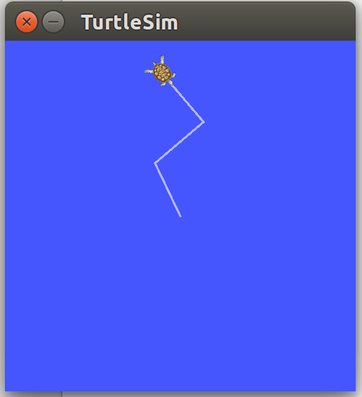
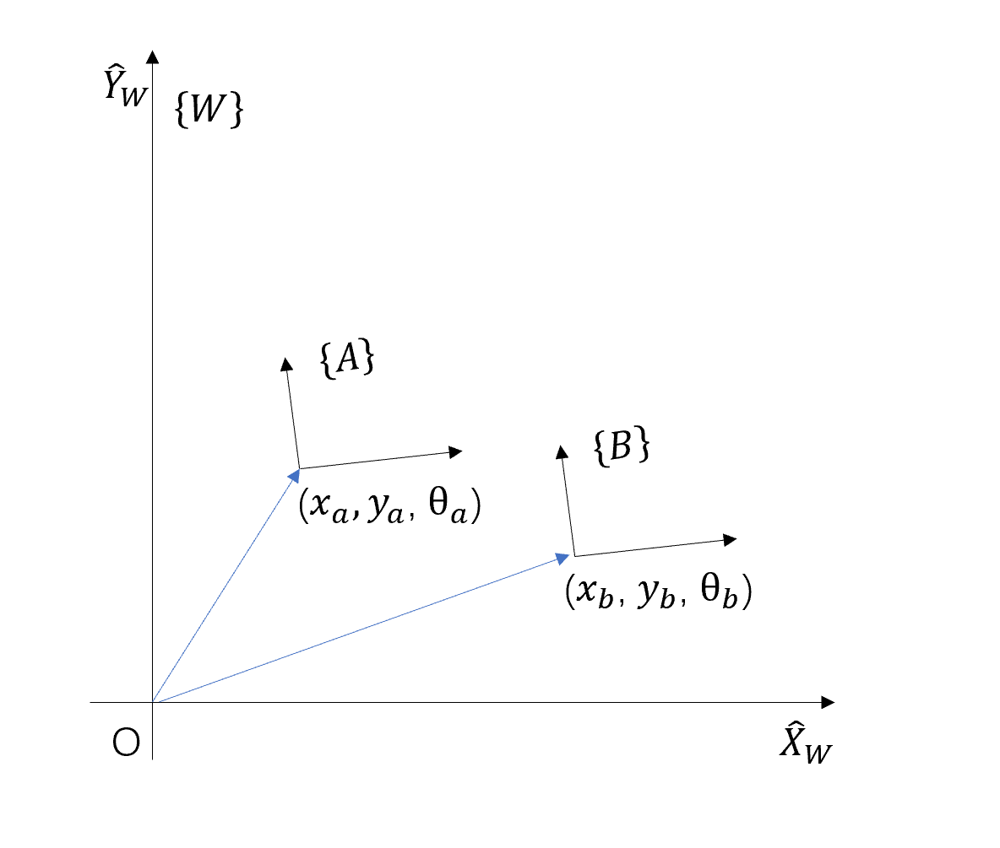
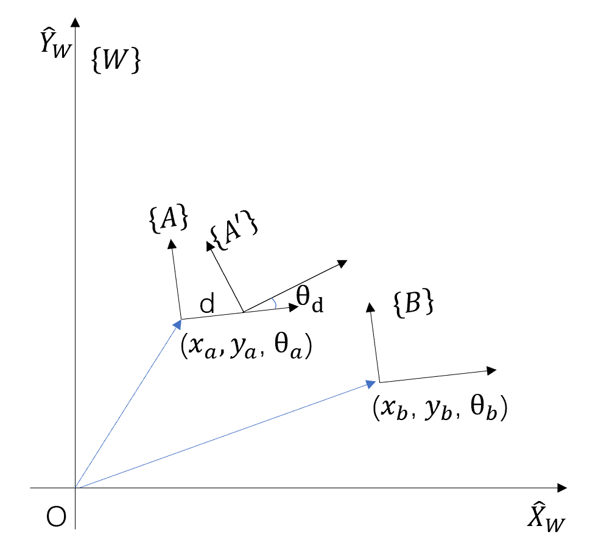

1. > 了解 Linux 系统：阅读《鸟哥的 Linux 私房菜》自学前三部分内容，或利用互联网进行学习，简答以下问题；（3 分）
   1. > 列举三个你常用的 Linux 命令，并说明他们的功能。
      1. `man` 指令，是manual(操作说明)的缩写，该指令用于查看其他指令的详细说明；比如 `$ man date` ，就会出现有关 `date` 的详细说明。
      2. `cd` 指令，是change directory（改变目录）的缩写，该指令用于改变工作目录；比如 `$ cd /home/tx-ubuntu64` ，就会将当前目录变为 `/home/tx-ubuntu64` 。
      3. `mkdir` 指令，是make directory（创建目录）的缩写，该指令用于创建新目录；比如 `$ mkdir abc` ,就会创建文件夹abc。
   2. > 一句话简要介绍 Vim 的功能，如何在 Vim 中进行插入和删除，如何保存并退出 Vim？
      1. Vim 是 vi 进阶版本的文本编辑器，Vim 可以用颜色或底线等方式来显示一些特殊的信息。
      2. 在一般模式中，按下 `i` （i, I, o, O, a, A, r, R）进入编辑模式，开始编辑（包括插入和删除）文字，按下 `Esc` 即可退出编辑模式。
      3. 在一般模式中，按下 `:wq` 保存并退出Vim。
   3. > 列举两种常用的 Linux 压缩和解压缩命令。
      1. `tar` 指令，解压 `tar zxvf FileName.tar.gz` ，压缩 `tar zcvf FileName.tar.gz DirName` 。
      2. `unzip` 指令与 `zip` 指令，解压 `unzip FileName.zip` ，压缩 `zip -q -r FileName.zip FileName` 。
  
2. > 了解 ROS：观看 ROS 免费公开课或前往 ROS 官网学习官方教程，安装好 ROS，提供运行小海龟跑的截图；（3 分）
  
      
  
    *这里需要注意ROS更新过key，最好使用英文版安装教程。*  
  
3. > 学习机器人姿态描述入门材料，完成坐标转换推导；（3 分）
设机器人的世界坐标为 xa, ya，其相对于世界坐标系的方向为 θa（右手坐标系）。假设机器人旁边有一物体在世界坐标系下的位姿为（xb, yb, θb）,请问：
   1. > 该物体相对于机器人的位置和朝向是什么，即该物体在当前机器人坐标系下的位姿是多少？
  
        解：设世界坐标系为 $\{W\}$ ，机器人坐标系为 $\{A\}$ ，物体坐标系为 $\{B\}$ ，则
        
        $$
            \begin{aligned}
            ^A_BT&=^A_WT\cdot^W_BT \\
            &=^W_AT^{-1}\cdot^W_BT \\
            &=\begin{bmatrix}
            ^W_AR^T & -^W_AR^T\cdot^W_AP \\
            0 & 1 \\
            \end{bmatrix}\cdot\begin{bmatrix}
            ^W_BR & ^W_BP \\
            0 & 1 \\
            \end{bmatrix} \\
            &=\begin{bmatrix}
            ^W_AR^T\cdot^W_BR & ^W_AR^T\cdot^W_BP-^W_AR^T\cdot^W_AP \\
            0 & 1 \\
            \end{bmatrix} \\
            &=\begin{bmatrix}
            ^W_AR^T\cdot^W_BR & ^W_AR^T\cdot(^W_BP-^W_AP) \\
            0 & 1 \\
            \end{bmatrix}
            \end{aligned}
        $$
        式中：
        $$
            \begin{aligned}
            ^W_AR^T\cdot^W_BR&=\begin{bmatrix}
            cos\theta_a & -sin\theta_a \\
            sin\theta_a & cos\theta_a \\
            \end{bmatrix}^T\cdot\begin{bmatrix}
            cos\theta_b & -sin\theta_b \\
            sin\theta_b & cos\theta_b \\
            \end{bmatrix} \\
            &=\begin{bmatrix}
            cos\theta_a & sin\theta_a \\
            -sin\theta_a & cos\theta_a \\
            \end{bmatrix}\cdot\begin{bmatrix}
            cos\theta_b & -sin\theta_b \\
            sin\theta_b & cos\theta_b \\
            \end{bmatrix}  \\
            &=\begin{bmatrix}
            cos\theta_acos\theta_b+sin\theta_asin\theta_b & -cos\theta_asin\theta_b+sin\theta_acos\theta_b \\
            -sin\theta_acos\theta_b+cos\theta_asin\theta_b & sin\theta_asin\theta_b+cos\theta_acos\theta_b \\
            \end{bmatrix}  \\
            &=\begin{bmatrix}
            cos(\theta_b-\theta_a) & -sin(\theta_b-\theta_a) \\
            sin(\theta_b-\theta_a) & cos(\theta_b-\theta_a) \\
            \end{bmatrix}
            \end{aligned}
        $$
        $$
            \begin{aligned}
            ^W_AR^T\cdot(^W_BP-^W_AP)&=\begin{bmatrix}
            cos\theta_a & -sin\theta_a \\
            sin\theta_a & cos\theta_a \\
            \end{bmatrix}^T\cdot(\begin{bmatrix}
            x_b \\
            y_b \\
            \end{bmatrix}-\begin{bmatrix}
            x_a \\
            y_a \\
            \end{bmatrix}) \\
            &=\begin{bmatrix}
            cos\theta_a & sin\theta_a \\
            -sin\theta_a & cos\theta_a \\
            \end{bmatrix}\cdot\begin{bmatrix}
            x_b-x_a \\
            y_b-y_a \\
            \end{bmatrix}  \\
            &=\begin{bmatrix}
            (x_b-x_a)cos\theta_a+(y_b-y_a)sin\theta_a \\
            -(x_b-x_a)sin\theta_a+(y_b-y_a)cos\theta_a \\
            \end{bmatrix}
            \end{aligned}
        $$
        代入：
        $$
            \begin{aligned}
            ^A_BT&=\begin{bmatrix}
            cos(\theta_b-\theta_a) & -sin(\theta_b-\theta_a) & (x_b-x_a)cos\theta_a+(y_b-y_a)sin\theta_a\\
            sin(\theta_b-\theta_a) & cos(\theta_b-\theta_a) & -(x_b-x_a)sin\theta_a+(y_b-y_a)cos\theta_a\\
            0 & 0 & 1\\
            \end{bmatrix}
            \end{aligned}
        $$
        位姿为：$((x_b-x_a)cos\theta_a+(y_b-y_a)sin\theta_a,-(x_b-x_a)sin\theta_a+(y_b-y_a)cos\theta_a,\theta_b-\theta_a)$。
  
   2. > 机器人此时朝它的正前方（机器人坐标系 X 轴）行进了 d 距离，然后又转了 θd角，请问物体此时在这一时刻机器人坐标系下的位姿是多少？

        解：移动后的机器人坐标系为 $\{A'\}$ ，则
        
        $$
            \begin{aligned}
            ^{A'}_BT&=^{A'}_AT\cdot^A_BT \\
            &=^A_{A'}T^{-1}\cdot^A_BT \\
            &=\begin{bmatrix}
            ^A_{A'}R^T & -^A_{A'}R^T\cdot^A_{A'}P \\
            0 & 1 \\
            \end{bmatrix}\cdot\begin{bmatrix}
            ^A_BR & ^A_BP \\
            0 & 1 \\
            \end{bmatrix} \\
            &=\begin{bmatrix}
            ^A_{A'}R^T\cdot^A_BR & ^A_{A'}R^T\cdot^A_BP-^A_{A'}R^T\cdot^A_{A'}P \\
            0 & 1 \\
            \end{bmatrix} \\
            &=\begin{bmatrix}
            ^A_{A'}R^T\cdot^A_BR & ^A_{A'}R^T\cdot(^A_BP-^A_{A'}P) \\
            0 & 1 \\
            \end{bmatrix}
            \end{aligned}
        $$
        式中：
        $$
            \begin{aligned}
            ^A_{A'}R^T\cdot^A_BR&=\begin{bmatrix}
            cos\theta_d & -sin\theta_d \\
            sin\theta_d & cos\theta_d \\
            \end{bmatrix}^T\cdot\begin{bmatrix}
            cos(\theta_b-\theta_a) & -sin(\theta_b-\theta_a) \\
            sin(\theta_b-\theta_a) & cos(\theta_b-\theta_a) \\
            \end{bmatrix} \\
            &=\begin{bmatrix}
            cos\theta_d & sin\theta_d \\
            -sin\theta_d & cos\theta_d \\
            \end{bmatrix}\cdot\begin{bmatrix}
            cos(\theta_b-\theta_a) & -sin(\theta_b-\theta_a) \\
            sin(\theta_b-\theta_a) & cos(\theta_b-\theta_a) \\
            \end{bmatrix}  \\
            &=\begin{bmatrix}
            cos\theta_dcos(\theta_b-\theta_a)+sin\theta_dsin(\theta_b-\theta_a) & -cos\theta_dsin(\theta_b-\theta_a)+sin\theta_dcos(\theta_b-\theta_a) \\
            -sin\theta_dcos(\theta_b-\theta_a)+cos\theta_dsin(\theta_b-\theta_a) & sin\theta_dsin(\theta_b-\theta_a)+cos\theta_dcos(\theta_b-\theta_a) \\
            \end{bmatrix}  \\
            &=\begin{bmatrix}
            cos((\theta_b-\theta_a)-\theta_d) & -sin((\theta_b-\theta_a)-\theta_d) \\
            sin((\theta_b-\theta_a)-\theta_d) & cos((\theta_b-\theta_a)-\theta_d) \\
            \end{bmatrix} \\
            &=\begin{bmatrix}
            cos(\theta_b-\theta_a-\theta_d) & -sin(\theta_b-\theta_a-\theta_d) \\
            sin(\theta_b-\theta_a-\theta_d) & cos(\theta_b-\theta_a-\theta_d) \\
            \end{bmatrix} \\
            \end{aligned}
        $$
        $$
            \begin{aligned}
            ^A_{A'}R^T\cdot(^A_BP-^A_{A'}P)&=\begin{bmatrix}
            cos\theta_d & -sin\theta_d \\
            sin\theta_d & cos\theta_d \\
            \end{bmatrix}^T\cdot(\begin{bmatrix}
            (x_b-x_a)cos\theta_a+(y_b-y_a)sin\theta_a \\
            -(x_b-x_a)sin\theta_a+(y_b-y_a)cos\theta_a \\
            \end{bmatrix}-\begin{bmatrix}
            d \\
            0 \\
            \end{bmatrix}) \\
            &=\begin{bmatrix}
            cos\theta_d & sin\theta_d \\
            -sin\theta_d & cos\theta_d \\
            \end{bmatrix}\cdot\begin{bmatrix}
            (x_b-x_a)cos\theta_a+(y_b-y_a)sin\theta_a-d \\
            -(x_b-x_a)sin\theta_a+(y_b-y_a)cos\theta_a \\
            \end{bmatrix}  \\
            &=\begin{bmatrix}
            [(x_b-x_a)cos\theta_a+(y_b-y_a)sin\theta_a-d]cos\theta_d+[-(x_b-x_a)sin\theta_a+(y_b-y_a)cos\theta_a]sin\theta_d \\
            -[(x_b-x_a)cos\theta_a+(y_b-y_a)sin\theta_a-d]sin\theta_d+[-(x_b-x_a)sin\theta_a+(y_b-y_a)cos\theta_a]cos\theta_d \\
            \end{bmatrix}
            \end{aligned}
        $$
        代入：
        $$
            \begin{aligned}
            ^{A'}_BT&=\begin{bmatrix}
            cos(\theta_b-\theta_a-\theta_d) & -sin(\theta_b-\theta_a-\theta_d) & [(x_b-x_a)cos\theta_a+(y_b-y_a)sin\theta_a-d]cos\theta_d+[-(x_b-x_a)sin\theta_a+(y_b-y_a)cos\theta_a]sin\theta_d\\
            sin(\theta_b-\theta_a-\theta_d) & cos(\theta_b-\theta_a-\theta_d) & -[(x_b-x_a)cos\theta_a+(y_b-y_a)sin\theta_a-d]sin\theta_d+[-(x_b-x_a)sin\theta_a+(y_b-y_a)cos\theta_a]cos\theta_d\\
            0 & 0 & 1\\
            \end{bmatrix}
            \end{aligned}
        $$
        位姿为：$([(x_b-x_a)cos\theta_a+(y_b-y_a)sin\theta_a-d]cos\theta_d+[-(x_b-x_a)sin\theta_a+(y_b-y_a)cos\theta_a]sin\theta_d,-[(x_b-x_a)cos\theta_a+(y_b-y_a)sin\theta_a-d]sin\theta_d+[-(x_b-x_a)sin\theta_a+(y_b-y_a)cos\theta_a]cos\theta_d,\theta_b-\theta_a-\theta_d)$。  
  
    *这题需要知道转换矩阵可以是坐标系的描述，也可以表示主动变换和被动变换；这里可以发现，在二维平面中，角度直接加减就可，在上面的坐标系中也可以比较明显得看出来。*  
  
4. > 完成基础数学坐标转换的代码作业。（3 分） 
  
    *这题的原理比较简单，就是已知 $^O_AT$ 、 $^O_BT$ ，求 $^B_AT$ ， $^B_AT=^B_OT\cdot^O_AT=^O_BT^{-1}\cdot^O_AT$ 。*  
  
    ```cpp
    // TODO 参照第一课PPT
    // start your code here (5~10 lines)
    Eigen::Matrix3d TOA;
    TOA << cos(A(2)), -sin(A(2)), A(0),
        sin(A(2)),  cos(A(2)), A(1),
            0,          0,        1;
    Eigen::Matrix3d TBA = TBO * TOA;
    cout << TBA << std::endl;
    BA << TBA(0, 2),
        TBA(1, 2),
        atan2(TBA(1, 0), TBA(0, 0));
    // end your code here
    ```
    运行结果为：  
    ```sh
    $ ./basicTransformStudy 
    TBA:
    -1.83697e-16           -1            2
            1 -1.83697e-16            1
            0            0            1
    The right answer is BA: 2 1 1.5708
    Your answer is BA:      2      1 1.5708
    ```
    详见代码仓库。  
