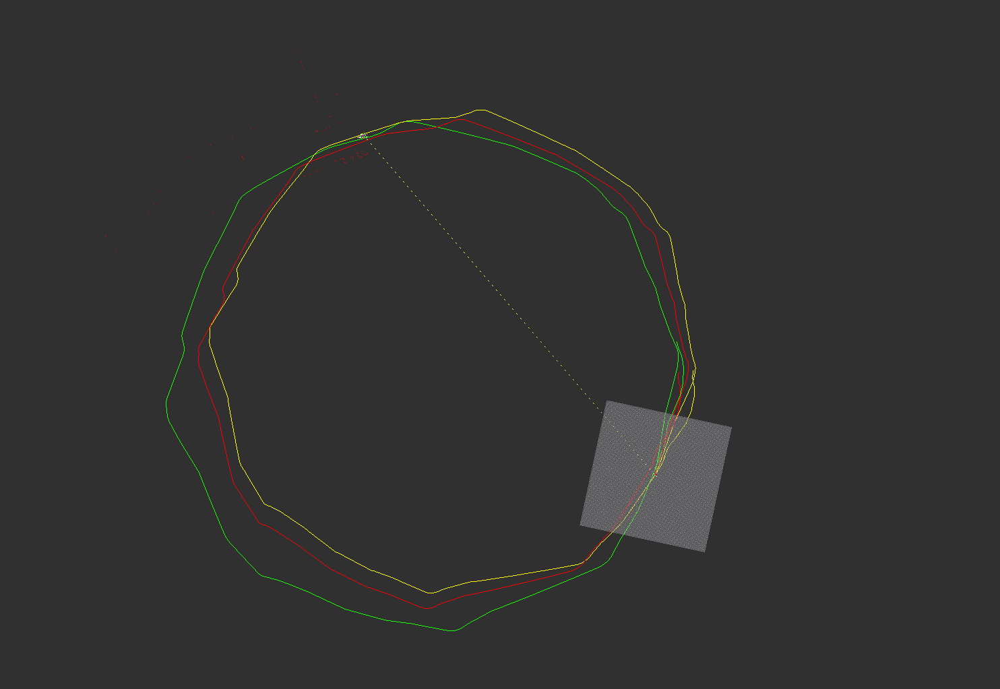

1. > 补充直接线性方法的里程计标定模块代码；（6 分)
   1. > Main.cpp，第 358 行中的 cal_delta_distance()函数,该函数的功能为给定两个里程计位姿,计算这两个位姿之间的位姿差。  
  
        *这里是上一章的内容，已知上一时刻的位姿和当前位姿，求位姿差。假设odom原点为世界坐标系 $\{W\}$ 的原点，上一时刻的位姿为 $^W_{last}T$ ，当前位姿为 $^W_{now}T$，位姿差为 $^{last}_{now}T=^{last}_WT\cdot{^W_{now}T}={^W_{last}T}^{-1}\cdot{^W_{now}T}$ 。*  
        ```cpp
        //TODO:
        // std::cout << "last_pos: " << last_pos << std::endl;
        // std::cout << "now_pos: " << now_pos << std::endl;
        Eigen::Matrix3d T_last, T_now, T_last_now;
        T_last << cos(last_pos(2)), -sin(last_pos(2)), last_pos(0),
                sin(last_pos(2)),  cos(last_pos(2)), last_pos(1),
                                0,                 0,           1;
        
        T_now << cos(now_pos(2)), -sin(now_pos(2)), now_pos(0),
                sin(now_pos(2)),  cos(now_pos(2)), now_pos(1),
                            0,                0,          1;

        T_last_now = T_last.inverse() * T_now;
        d_pos << T_last_now(0, 2),
                T_last_now(1, 2),
                atan2(T_last_now(1, 0), T_last_now(0, 0));
        // std::cout << "d_pos: " << d_pos << std::endl;
        //end of TODO
        ```

   2. > Odom_Calib.cpp，第 28 行 Add_Data()函数，该函数的功能为构建超定方程组 Ax=b ，具体参考PPT。
  
        *这里就是本章的内容了，课程看懂还是比较简单的，需要注意的是 bag 中 scan 的数据有13515条，初始化的时候只设置了12000，虽然不是每条数据都 `Add_Data()` ，还是存在越界的可能性，有两种办法，一种是数据超过了就循环添加，另一种是数据超过了就不添加，可以用 `OdomCalib::is_full()` 判断数据是否满了。*  
        ```cpp
        //TODO: 构建超定方程组
        A(now_len % data_len * 3, 0) =  Odom(0);
        A(now_len % data_len * 3, 1) =  Odom(1);
        A(now_len % data_len * 3, 2) =  Odom(2);
        A(now_len % data_len * 3 + 1, 3) =  Odom(0);
        A(now_len % data_len * 3 + 1, 4) =  Odom(1);
        A(now_len % data_len * 3 + 1, 5) =  Odom(2);
        A(now_len % data_len * 3 + 2, 6) =  Odom(0);
        A(now_len % data_len * 3 + 2, 7) =  Odom(1);
        A(now_len % data_len * 3 + 2, 8) =  Odom(2);
        
        b(now_len % data_len * 3) = scan(0);
        b(now_len % data_len * 3 + 1) = scan(1);
        b(now_len % data_len * 3 + 2) = scan(2);
        //end of TODO
        ```
  
   3. > Odom_Calib.cpp，第 48 行 Solve()函数，该函数的功能为对 2 中构建的超定方程组进行求解。  
  
        *这里比较纠结的是如何求解，可以直接求解，也可以用 [Eigen库](http://eigen.tuxfamily.org/dox/group__TopicLinearAlgebraDecompositions.html)，这题里我感觉区别不大，都是瞬间完成。*  
        ```cpp
        //TODO: 求解线性最小二乘
        Eigen::VectorXd x(9);
        x.setZero();
        x = A.colPivHouseholderQr().solve(b);
        // x = (A.transpose() * A).inverse() * A.transpose() * b;
        correct_matrix << x(0), x(1), x(2),
                        x(3), x(4), x(5),
                        x(6), x(7), x(8);
        //end of TODO
        ```
        最终运行结果为：
        ```sh
        $ rosrun calib_odom calib_odom_node 
        Calibration Online,Wait for Data!!!!!!!
        Data Cnt:1
        Data Cnt:2
        Data Cnt:3
        Data Cnt:4
        Data Cnt:5
        Data Cnt:6
        Data Cnt:7
        ...
        Data Cnt:2529
        Data Cnt:2530
        Data Cnt:2531
        Data Cnt:2532
        Data Cnt:2533
        Data Cnt:2534
        Data Cnt:2535
        Data Cnt:2536
        Data Cnt:2537
        Data Cnt:2538
        correct_matrix:
        0.936021    2.12719 -0.0493377
        -0.0129068    6.77194   0.154061
        0.00130529    22.6874   0.400535
        calibration over!!!!
        ```
        绿色为 odom ，黄色为激光，红色为矫正后的轨迹：
        
  
    *在写作业的时候，我有个疑问 `Scan2::getOdomPose()` 这个函数获取的里程计数据是给定时刻的位姿还是给定时刻最近数据的位姿，如果是给定时刻的位姿，那么它内部是怎么实现的。`Scan2::getOdomPose()` 中调用了 `tf` 的 `transformPose()` ，查找了API文档，没有仔细说明，这就让我比较纠结了，把 ros/geometry2 的代码扒下来大致浏览了下，经过好多次跳转最后发现在 `cache.cpp` 中有使用 `interpolate()` 函数来线性插值，这个函数中又分别使用了位置和角度线性插值函数，看到这就比较放心了。再吐槽下，第一题的代码中将 plicp 错误拼写为 piicp ，视频里也说错了。*  

2. > 补充基于模型方法的里程计标定模块代码；（2 分）
   ```cpp
    // 填充A, b矩阵
    //TODO: (3~5 lines)
    A(id_s, 0) = w_Lt;
    A(id_s, 1) = w_Rt;
    b(id_s) = s_th;
    //end of TODO
   ```
   ```cpp
    // 进行最小二乘求解
    Eigen::Vector2d J21J22;
    //TODO: (1~2 lines)
    J21J22 = A.colPivHouseholderQr().solve(b);
    //end of TODO
   ```
   ```cpp
    // 填充C, S矩阵
    //TODO: (4~5 lines)
    C(id_s * 2) = cx;
    C(id_s * 2 +1) = cy;
    S(id_s * 2) = s_x;
    S(id_s * 2 +1) = s_y;
    //end of TODO
   ```
   ```cpp
    //TODO: (3~5 lines)
    // std::cout << C.colPivHouseholderQr().solve(S) << std::endl;
    Eigen::VectorXd b_tmp = C.colPivHouseholderQr().solve(S);
    b_wheel = b_tmp(0);
    r_L = -J21 * b_wheel;
    r_R = J22 * b_wheel;
    //end of TODO
   ```
   最终运行结果为：
   ```sh
    $ ./odom_calib
    J21: -0.163886
    J22: 0.170575
    b: 0.59796
    r_L: 0.0979974
    r_R: 0.101997
    参考答案：轮间距b为0.6m左右，两轮半径为0.1m左右
   ```
    *模型法更通用的做法可以参考论文《Simultaneous Calibration of Odometry and Sensor Parameters for Mobile Robots》，贺博在[博客](https://blog.csdn.net/heyijia0327/article/details/88571176)中也有介绍，还有实现的[代码](https://github.com/MegviiRobot/OdomLaserCalibraTool)，后续有时间要细细查看。*  
  
3. > 通过互联网总结学习线性方程组 Ax=b 的求解方法，回答以下问题：（2 分）
   1. > 对于该类问题，你都知道哪几种求解方法？
   
        这里只考虑 Ax=b 为超定方程组，所以求最小二乘解。一般有三种求解方法：SVD分解、QR分解、正规矩阵(normal equation)。
  
   2. > 各方法的优缺点有哪些？分别在什么条件下较常被使用？
     
        在这三种方程中，SVD分解通常准确率最高，但是速度最慢，对准确性高的情况下使用该求解方法；正规矩阵速度最快，但是准确率最低，如果矩阵 $A$ 是病态的，那么这不是一个好方法，因为 $A^TA$ 是 $A$ 的平方，这意为着使用正规方程所造成的损失是使用其他方法所造成损失的两倍，存在病态矩阵的情况下不使用该方法；QR分解位于两者之间，Eigen中QR分解类有三个：HouseholderQR（没有枢转，快速但不稳定），ColPivHouseholderQR（列枢转，因此有一些慢但是更准确），FullPivHouseholderQR（完全旋转，最慢，但是最稳定），我一般会使用ColPivHouseholderQR方法。
  
4. > 简答题，开放性答案：设计里程计与激光雷达外参标定方法。（2 分）  
    我们一般把传感器内自身要调节的参数称为内参，比如前面作业中里程计模型的两轮间距与两个轮子的半径。把传感器之间的信息称为外参，比如里程计与激光雷达之间的时间延迟，位姿变换等。请你选用直接线性方法或基于模型的方法，设计一套激光雷达与里程计外参的标定方法，并回答以下问题：
   1. > 你设计的方法是否存在某些假设？基于这些假设下的标定观测值和预测值分别是什么？
  
        使用模型法标定激光雷达与里程计的相对角度（yaw），假设激光雷达与车体相对位置的x、y值为0，仅有一个角度偏差（yaw）；且里程计的内参已经标定完成。标定观测值为激光雷达的匹配值，预测值为里程计的积分值。
  
   2. > 如何构建你的最小二乘方程组求解该外参？
  
        设 $r_x\quad r_y$ 为里程计积分值， $s_x\quad s_y$ 为激光雷达的匹配值,激光雷达与里程计的相对角度（yaw）为 $\theta$ 。
        $$
        \begin{bmatrix}
            s_x \\
            s_y
        \end{bmatrix}=\begin{bmatrix}
            \cos\theta & -\sin\theta \\
            \sin\theta & \cos\theta
        \end{bmatrix}\cdot\begin{bmatrix}
            r_x \\
            r_y
        \end{bmatrix}
        $$
        得到：
        $$
        \begin{bmatrix}
            r_y & r_x \\
            -r_x & r_y
        \end{bmatrix}\cdot\begin{bmatrix}
            \sin\theta \\
            \cos\theta
        \end{bmatrix}=\begin{bmatrix}
            s_x \\
            s_y
        \end{bmatrix}
        $$
        由n组数据，构建最小二程方程组：
        $$
        \begin{bmatrix}
            r_{y0} & r_{x0} \\
            -r_{x0} & r_{y0} \\
            \vdots & \vdots \\
            r_{yn} & r_{xn} \\
            -r_{xn} & r_{yn} \\
        \end{bmatrix}\cdot\begin{bmatrix}
            \sin\theta \\
            \cos\theta
        \end{bmatrix}=\begin{bmatrix}
            s_{x0} \\
            s_{y0} \\
            \vdots \\
            s_{xn} \\
            s_{yn} \\
        \end{bmatrix} \\[2ex]
        Ax=b
        $$
        得到 $\sin\theta\quad\cos\theta$ ，因此： $\operatorname \theta=atan2(\sin\theta, \cos\theta)$ 。