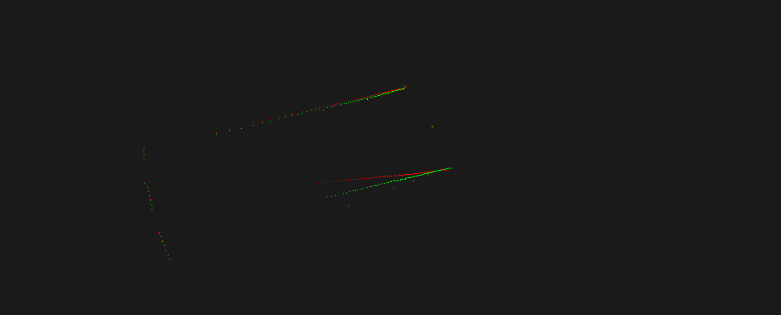
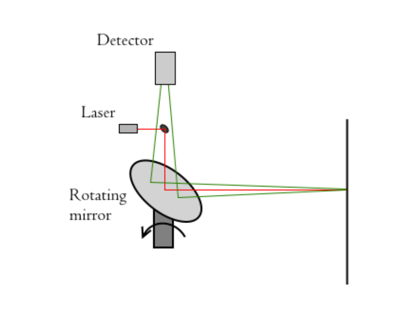
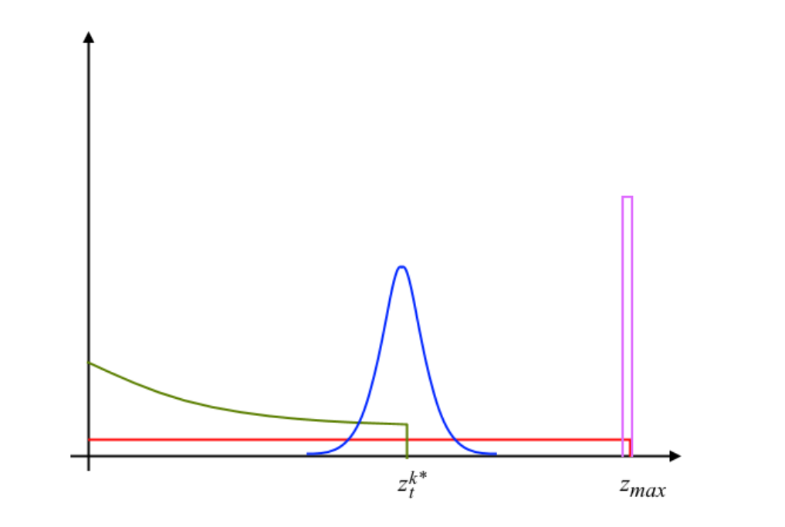

1. > 补充去除激光雷达运动畸变模块的代码；(6 分)
  
   *设世界坐标系 $\{W}\$ 的原点与odom坐标系的原点重合， $\{B\}$ 为某一帧激光数据的基坐标（一般为第一束激光测量时的坐标）， $\{S-E\}$ 为激光采样过程中每一束激光测量时对应的坐标（start to end frame）, $\{B\}$ 和 $\{S-E\}$ 都是激光坐标系，只是在不同的时间相对世界坐标系的位姿。默认每一束激光都是在基坐标时刻完成测量的，但是实际是激光雷达每帧的测量数据不是瞬间获得的，激光雷达帧率较低时，机器人的运动不能忽略。已知激光雷达坐标系在每束激光测量时刻的世界坐标和每束激光点相对于激光雷达的坐标，就可以得出每束激光点的世界坐标，最后再转换到基坐标上，就完成了激光雷达的运动畸变去除 $^BP=^W_BT^{-1}\cdot^W_{S-E}T\cdot^{S-E}P$ 。*  
   ```cpp
   //TODO
   for(int i = 0; i < beam_number; ++i)
   {
      double x = ranges[startIndex+i] * cos(angles[startIndex+i]);
      double y = ranges[startIndex+i] * sin(angles[startIndex+i]);

      tf::Vector3 v = frame_start_pose.getOrigin().lerp(frame_end_pose.getOrigin(), (double)i/(beam_number-1));
      tf::Quaternion q = frame_start_pose.getRotation().slerp(frame_end_pose.getRotation(), (double)i/(beam_number-1));

      //B   W -1     W    S-E
      // P = T   *    T *    P
      //    B      S-E
      tf::Vector3 v_cal = frame_base_pose.inverse() * tf::Transform(q, v) * tf::Vector3(x, y, 1);
      
      ranges[startIndex+i] = sqrt(v_cal.getX()*v_cal.getX() + v_cal.getY()*v_cal.getY());
      angles[startIndex+i] = atan2(v_cal.getY(), v_cal.getX());

      // double yawW = tf::getYaw(q);
      // double xW = x * cos(yawW) - y * sin(yawW) + v.getX();
      // double yW = x * sin(yawW) + y * cos(yawW) + v.getY();

      // double yawB = tf::getYaw(frame_base_pose.getRotation());
      // double xB = (xW - frame_base_pose.getOrigin().getX()) * cos(yawB) + (yW - frame_base_pose.getOrigin().getY()) * sin(yawB);
      // double yB = -(xW - frame_base_pose.getOrigin().getX()) * sin(yawB) + (yW - frame_base_pose.getOrigin().getY()) * cos(yawB);

      // ranges[startIndex+i] = sqrt(xB*xB + yB*yB);
      // angles[startIndex+i] = atan2(yB, xB);
   }
   //end of TODO
   ```
   两个窗口分别运行下述命令：
   ```sh
   $ roslaunch LaserUndistortion LaserUndistortion.launch
   $ rosbag  play laser.bag --clock
   ```
   得到结果（有时候有散点，没找到原因）：
   

   *后续打算自己录制数据再测试下。源码中使用 `getLaserPose()` 获取某个时刻的位姿，该函数中也是调用了 `tf_->transformPose()` ，上一章发现 `transformPose()` 函数内部也是通过线性插值来获取某个给定时刻的相对位姿，那么有个问题是既然可以通过上面函数来获取每一时刻的相对位姿为什么要使用分段函数来近似（源码中为5ms一段），猜测可能是会占用较多cpu（待测）。附上tf中[位置线性插值](http://docs.ros.org/en/jade/api/tf/html/c++/classtf_1_1Vector3.html#a49220836c2fc359bf9e7feb307cade5a)和[角度线性插值](http://docs.ros.org/en/jade/api/tf/html/c++/classtf_1_1Quaternion.html#affa098b16b0091af8b71bfb533b5494a)，以及[tf源码分析](https://zhuanlan.zhihu.com/p/28288871)的链接。*    
  
2. > 阅读论文 Least-Squares Fitting of Two 3-D Points Sets，推导并证明已知对应点的 ICP 求解方法；(2 分)
  
   问题描述：有两个已知对应点的点云 $\{p_i\}$ 和 $\{p'_i\}$ ( $i=1,2,3,\cdots$,N )，两组点云可以用下面的式子表示：
   $$
   p'_i=Rp_i+T+N_i\quad（R是旋转矩阵，T是平移向量，N_i是噪声向量） \\
   $$
   需要找到R和T使得下式最小：  
   $$
   {\Sigma}^2 = \sum^N_{i=1}{\lVert p'_i-(Rp_i+T)\rVert}^2
   $$
   题目中已知两组点云是已知对应点的，所以如果最小二乘解是 $\hat R$ 和 $\hat T$ ，那么 $\{p'_i\}$ 和 $\{p''_i\triangleq \hat Rp_i+\hat T\}$ 有相同的质心，即
   $$
   p'=p''
   $$
   这里
   $$
   p'\triangleq\frac{1}{N}\sum^N_{i=1}p'_i \\
   p''\triangleq\frac{1}{N}\sum^N_{i=1}p''_i= \hat Rp+\hat T\\
   p\triangleq\frac{1}{N}\sum^N_{i=1}p_i \\
   $$
   两组点云分别减去其质心（就相当于把两组点云都挪到原点，只剩旋转了）：
   $$
   q_i\triangleq pi -p \\
   q'_i\triangleq p'_i-p'
   $$
   因此目标函数转换为：
   $$
   {\Sigma}^2 = \sum^N_{i=1}{\lVert q'_i-Rq_i\rVert}^2
   $$
   原始的最小二乘问题转换为两部分：
   （i）找到 $\hat R$ 使得 ${\Sigma}^2$ 最小；
   （ii）代入 $\hat T=p'-\hat Rp$ 得到 $\hat T$ 。
   下面开始求解 $\hat R$ ：
   $$
   \begin{aligned}
      {\Sigma}^2 &= \sum^N_{i=1}(q'_i-Rq_i)^T(q'_i-Rq_i) \\
      &=\sum^N_{i=1}(q'^T_i-q^T_iR^T)(q'_i-Rq_i) \\
      &=\sum^N_{i=1}(q'^T_iq'_i-q'^T_iRq_i-q^T_iR^Tq'_i+q^T_iR^TRq_i) \\
      &=\sum^N_{i=1}(q'^T_iq'_i+q^T_iq_i-2q'^T_iRq_i)\quad(标量的转置等于其本身)
   \end{aligned}
   $$
   求 ${\Sigma}^2$ 的最大值等价于求下式的最小值：
   $$
   \begin{aligned}
      F&=\sum^N_{i=1}q'^T_iRq_i \\
      &=\operatorname{Trace}(q'^T_iRq_i)\quad（标量的迹是其本身） \\
      &=\operatorname{Trace}(Rq_iq'^T_i)\quad（\operatorname{Trace}(AB)=\operatorname{Trace}(BA)，这里不要求 A, B 为方阵，只要 A*B 是方阵即可） \\
      &=\operatorname{Trace}(RH)\quad（H\triangleq\sum^N_{i=1}q_iq'^T_i） \\
   \end{aligned}
   $$
   已知，对于正定对称矩阵 $A$ ，任意的正交矩阵 $B$ ，都有 $\operatorname{Trace}(A)\geq\operatorname{Trace}(BA)$； $H$ 为非正定对称矩阵，需要构造正定对称矩阵才能应用上述式子，SVD分解 $H=U\Sigma V^T$ ；构建正交矩阵 $X$ ，令 $X=VU^T$ ； $XH=VU^TU\Sigma V^T=V\Sigma V^T$ ，为正定对称矩阵（代入 $A$ ）。
   对于任意正交矩阵 $B$ ，可得 $\operatorname{Trace}(XH)\geq\operatorname{Trace}(BXH)$ ，将 $R$ 代入 $BX$ 可得 $\operatorname{Trace}(RH)\leq\operatorname{Trace}(XH)$ ，只有 $R=X$ 时， $\operatorname{Trace}(RH)$ 取得最大值，得到：
   $$
   \hat R=X=VU^T \\
   \hat T=p'-\hat Rp
   $$

   还有来自论文《Least-Squares Rigid Motion Using SVD》的另一种方法，知乎也有 [InsaneGuy大神](https://zhuanlan.zhihu.com/p/104735380) 推导过，直接从中间开始：
   $$
   \begin{aligned}
      F&=\sum^N_{i=1}q'^T_iRq_i \\
      &=\operatorname{Trace}(RH)\quad（到这里为止上面已经求过了，下面正式开始） \\
      &=\operatorname{Trace}(RU\Sigma V^T)\quad \\
      &=\operatorname{Trace}(\Sigma V^TRU)\quad \\
   \end{aligned}
   $$
   这里 $U、V、R$ 都是正交矩阵，所以 $V^TRU$ 也是正交矩阵，令：
   $$
   M=V^TRU=\begin{bmatrix}
      m_{11} & m_{12} & m_{13} \\
      m_{21} & m_{22} & m_{23} \\
      m_{31} & m_{32} & m_{33}
   \end{bmatrix}，则有： \\[2ex]
   \operatorname{Trace}(\Sigma V^TRU)=\operatorname{Trace}(\Sigma M)={\sigma}_1m_{11}+{\sigma}_2m_{22}+{\sigma}_3m_{33}
   $$
   根据奇异值非负的性质和正交矩阵的性质 $\lvert m_{ij}\rvert\leq1$，易得 $M=I$ 时 $\operatorname{Trace}(\Sigma M)$ 取得最大值。  
   $$
   V^TRU=I \\
   R=VU^T
   $$
   到这里我们也得到了和第一种方法同样的结论，具体内容可以查看论文。
  
3. > 阅读论文 Precise indoor localization for mobile laser scanner 前两章，回答问题。（2 分）
   1. > 根据第二章内容，简述激光雷达测距原理；
  
      这里介绍下反光镜旋转的激光雷达原理，如下图所示，激光发射头通过光路经过反射镜照射到物体上，接着激光反射回再次经过反射镜被检测装置检测到，当反射镜旋转时，就可以测到该平面的物体的距离信息。
      这里有两种方式测量距离，分别为飞行时间法（TOF）和波形相位差法。飞行时间法可以直接获得激光发射的时间和接收到激光的时间差 $\Delta t$ ，通过公式 $r=\frac{\Delta t \cdot c}{n\cdot2}$ （ $r为距离，c为光速，n为光空气中的折射率$ ）来得到距离；相位差法首先需要通过公式 $\Delta t = \frac{\Delta \varphi}{2\pi\cdot f_m}$ （ $\Delta\varphi为测量所得，f_m为已知的调制频率$ ）来获取时间差，接着代入飞行时间法的公式中即可获取距离值。
      
  
   2. > 简要介绍一下下图的含义。
      
  
      蓝色表示具有局部测量噪声的正确范围(高斯分布)；绿色表示目标前方可能存在的动态障碍(指数分布)；红色表示来自意外来源的随机噪声（均匀分布）；粉色表示测量失败的可能性（均匀分布）。
  
4. > 简答题，开放性答案：设计使用 IMU 去除激光雷达运动畸变的方法并回答问题。（2 分）
   1. > 仅用 IMU 去除运动畸变可能会有哪些不足之处？
  
      IMU可以直接获得角速度和线加速度，测量角速度比较精确，但是线加速度精度太差，在局部二次积分后精度依然很差，所以使用IMU去除激光雷达运动畸变会存在旋转校准得比较好，但是平移校准得比较差的情况。
  
   2. > 在仅有 IMU 和激光雷达传感器的情况下，你会如何设计运动畸变去除方案(平移+旋转)，达到较好的畸变去除效果?
  
      可以使用IMU校准加匹配方法相结合的方式进行校准，先使用IMU进行校正，去除大部分畸变；认为IMU存在误差，但是误差是线性分布的；用ICP方法进行匹配，匹配结果作为正确值，得到IMU的误差值；把误差值均摊到每一个点上，重新进行激光点位置修正；再一次进行ICP迭代，知道收敛位置。

   