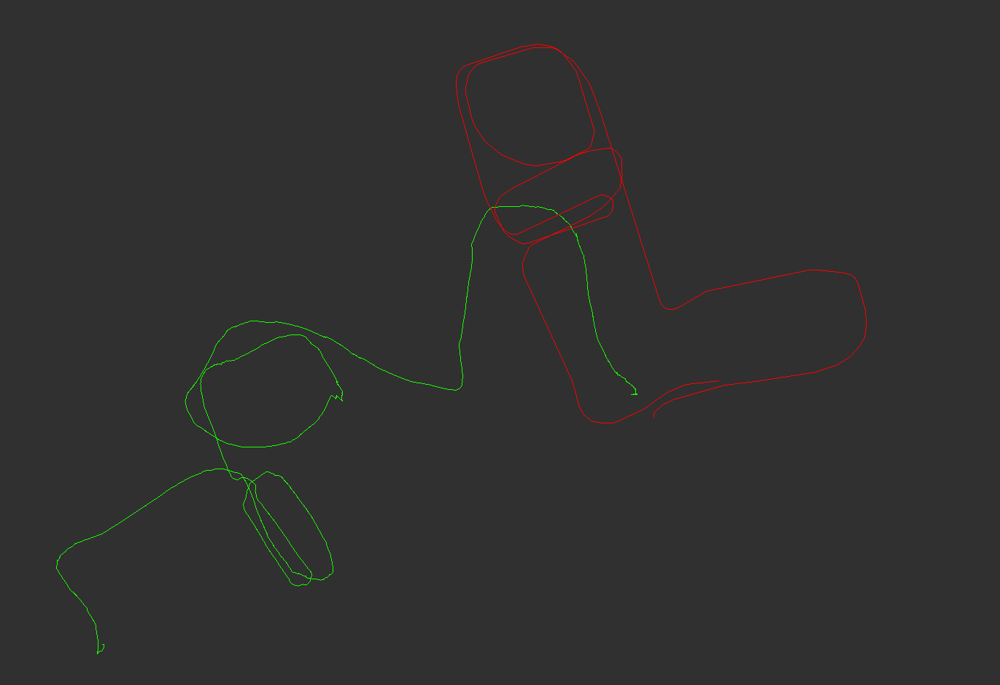
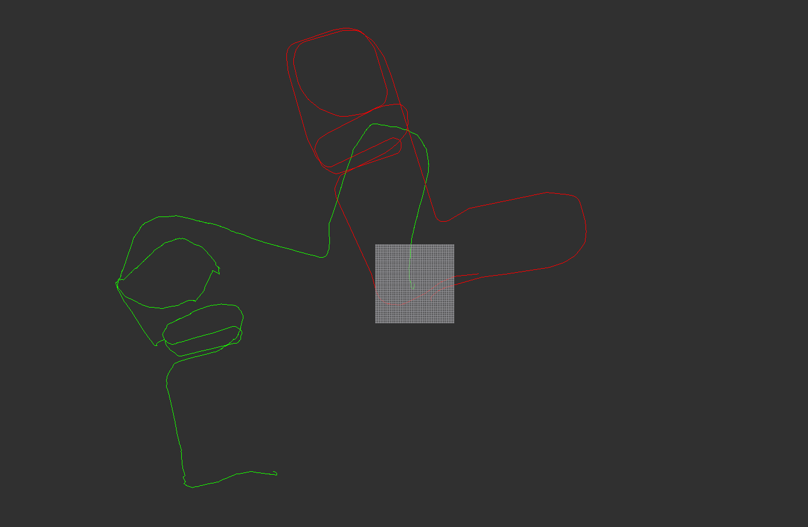

1. > 补充代码，实现两帧间的 IMLS-ICP 激光匹配；（6 分）

   1. > 实现 imls_icp.cpp 中的 computeNormal(ICP)函数，该部分可参考 PPT 中 NICP 法向量的计算方法；
   
        ```cpp
        //TODO
        //根据周围的激光点计算法向量，参考ppt中NICP计算法向量的方法
        Eigen::Vector2d average;
        average.setZero();
        for(auto v : nearPoints)
        {
            average += v / nearPoints.size();
        }

        Eigen::Matrix2d covariance;
        covariance.setZero();
        for(auto v : nearPoints)
        {
            covariance += (v - average) * (v - average).transpose() / nearPoints.size();
        }

        Eigen::EigenSolver<Eigen::Matrix2d> eigen_solver(covariance);
        Eigen::Vector2d eigenValues = eigen_solver.pseudoEigenvalueMatrix().diagonal();
        Eigen::Matrix2d eigenVectors = eigen_solver.pseudoEigenvectors();
        normal = eigenValues(0) < eigenValues(1) ? eigenVectors.col(0) : eigenVectors.col(1);
        //end of TODO
        ```
  
   2. > 实现 imls_icp.cpp 中的 ImplictMLSFunction(ICP)函数的高度计算部分;
  
        ```cpp
        //TODO
        //根据函数进行投影．计算height，即ppt中的I(x)
        double mh2 = m_h * m_h;
        for(int i = 0; i < nearPoints.size(); ++i)
        {
            Eigen::Vector2d delta_p = x - nearPoints[i];
            double weight = std::exp(-delta_p.squaredNorm()/mh2);
            projSum += delta_p.transpose() * nearNormals[i];
            weightSum += weight;
        }
        height = projSum / weightSum;
        //end of TODO
        ```
  
   3. > 实现 imls_icp.cpp 中的 projSourcePtToSurface(ICP)函数的 TODO 部分。
  
        ```cpp
        //TODO
        //计算yi．
        yi = xi - height * nearNormal;
        //end of TODO
        ```
  
    运行 `$ rosrun imlsMatcher imMatcher_node ` 后在rviz中得到结果为（绿色为激光里程计的路径，红色为轮式里程计的路径）：  
    
  
    *代码中需要安装libnabo库，可以通过apt安装ros的libnabo，也可以通过[源码安装](https://blog.csdn.net/qq_36501182/article/details/79043592)；使用rviz查看时frame可能不对，看不到路径，直接将frame改为odom就可以看到路径了；代码中使用了 `rosbag::Bag` 中的 `open()` 函数来打开bag文件，原来10分钟的bag包3分钟就跑完了，还是比较节省时间的（运行的时候看到cpu占用比较高，差点以为哪里出了问题）；最后一个问题是关于 `m_r` 和 `m_h` 的，将全部代码大致浏览了一遍，发现这两个参数有点混乱（注释和代码不统一），代码中 `m_r` 的默认参数为0.03， `m_h` 的默认参数为0.1，而论文实验中的h为0.06米，r为0.2米，参数调成论文中的参数，也修改了代码中的问题，最终跑的效果都不如原来的好，无奈只能维持原来的代码了o(╥﹏╥)o，这里以后有时间还需要仔细查看下。*  

2. > 将第一题 IMLS-ICP 匹配的接口换成第二次作业中 CSM 库的 ICP 匹配接口，并生成激光匹配的轨迹；（2 分）
  
   1. 将ChampionNavLaserScan转换为LDP：
        ```cpp
        //把激光雷达数据 转换为PL-ICP需要的数据
        void LaserScanToLDP(const champion_nav_msgs::ChampionNavLaserScanConstPtr& pScan,
                                LDP& ldp)
        {
            int nPts = pScan->ranges.size();
            ldp = ld_alloc_new(nPts);

            for(int i = 0;i < nPts;i++)
            {
                double dist = pScan->ranges[i];
                if(dist > 0.1 && dist < 20)
                {
                    ldp->valid[i] = 1;
                    ldp->readings[i] = dist;
                }
                else
                {
                    ldp->valid[i] = 0;
                    ldp->readings[i] = -1;
                }
                // ldp->theta[i] = pScan->angle_min+pScan->angle_increment*i;
                ldp->theta[i] = pScan->angles[i];

            }
            ldp->min_theta = ldp->theta[0];
            ldp->max_theta = ldp->theta[nPts-1];

            ldp->odometry[0] = 0.0;
            ldp->odometry[1] = 0.0;
            ldp->odometry[2] = 0.0;

            ldp->true_pose[0] = 0.0;
            ldp->true_pose[1] = 0.0;
            ldp->true_pose[2] = 0.0;
        }
        ```
  
    2. 修改championLaserScanCallback部分代码：
        ```cpp
        void championLaserScanCallback(const champion_nav_msgs::ChampionNavLaserScanConstPtr& msg)
        {
            static sm_params m_PLICPParams;
            if(m_isFirstFrame == true)
            {
                std::cout <<"First Frame"<<std::endl;
                m_isFirstFrame = false;
                m_prevLaserPose = Eigen::Vector3d(0, 0, 0);
                pubPath(m_prevLaserPose, m_imlsPath, m_imlsPathPub);
                LaserScanToLDP(msg, m_prevPointCloud);

                //设置PL-ICP的参数
                {
                    //设置激光的范围
                    m_PLICPParams.min_reading = 0.1;
                    m_PLICPParams.max_reading = 20;

                    //设置位姿最大的变化范围
                    m_PLICPParams.max_angular_correction_deg = 20.0;
                    m_PLICPParams.max_linear_correction = 1;

                    //设置迭代停止的条件
                    m_PLICPParams.max_iterations = 50;
                    m_PLICPParams.epsilon_xy = 0.000001;
                    m_PLICPParams.epsilon_theta = 0.0000001;

                    //设置correspondence相关参数
                    m_PLICPParams.max_correspondence_dist = 1;
                    m_PLICPParams.sigma = 0.01;
                    m_PLICPParams.use_corr_tricks = 1;

                    //设置restart过程，因为不需要restart所以可以不管
                    m_PLICPParams.restart = 0;
                    m_PLICPParams.restart_threshold_mean_error = 0.01;
                    m_PLICPParams.restart_dt = 1.0;
                    m_PLICPParams.restart_dtheta = 0.1;

                    //设置聚类参数
                    m_PLICPParams.clustering_threshold = 0.2;

                    //用最近的10个点来估计方向
                    m_PLICPParams.orientation_neighbourhood = 10;

                    //设置使用PI-ICP
                    m_PLICPParams.use_point_to_line_distance = 1;

                    //不进行alpha_test
                    m_PLICPParams.do_alpha_test = 0;
                    m_PLICPParams.do_alpha_test_thresholdDeg = 5;

                    //设置trimmed参数 用来进行outlier remove
                    m_PLICPParams.outliers_maxPerc = 0.9;
                    m_PLICPParams.outliers_adaptive_order = 0.7;
                    m_PLICPParams.outliers_adaptive_mult = 2.0;

                    //进行visibility_test 和 remove double
                    m_PLICPParams.do_visibility_test = 1;
                    m_PLICPParams.outliers_remove_doubles = 1;
                    m_PLICPParams.do_compute_covariance = 0;
                    m_PLICPParams.debug_verify_tricks = 0;
                    m_PLICPParams.use_ml_weights = 0;
                    m_PLICPParams.use_sigma_weights = 0;
                }
                return ;
            }

            LDP nowPts;
            LaserScanToLDP(msg, nowPts);

            //把当前的激光数据转换为 pl-icp能识别的数据 & 进行矫正
            //d_point_scan就是用激光计算得到的两帧数据之间的旋转 & 平移

            //设置匹配的参数值
            sm_result m_OutputResult;
            m_PLICPParams.laser_ref = m_prevPointCloud;
            m_PLICPParams.laser_sens = nowPts;

            m_OutputResult.cov_x_m = 0;
            m_OutputResult.dx_dy1_m = 0;
            m_OutputResult.dx_dy2_m = 0;

            sm_icp(&m_PLICPParams,&m_OutputResult);

            std::cout <<"PLICP Match Successful:"<<m_OutputResult.x[0]<<","<<m_OutputResult.x[1]<<","<<m_OutputResult.x[2]<<std::endl;
            Eigen::Matrix3d rPose;
            rPose << cos(m_OutputResult.x[2]), -sin(m_OutputResult.x[2]), m_OutputResult.x[0],
                        sin(m_OutputResult.x[2]),  cos(m_OutputResult.x[2]), m_OutputResult.x[1],
                        0, 0, 1;
            Eigen::Matrix3d lastPose;
            lastPose << cos(m_prevLaserPose(2)), -sin(m_prevLaserPose(2)), m_prevLaserPose(0),
                        sin(m_prevLaserPose(2)),  cos(m_prevLaserPose(2)), m_prevLaserPose(1),
                        0, 0, 1;
            Eigen::Matrix3d nowPose = lastPose * rPose;
            m_prevLaserPose << nowPose(0, 2), nowPose(1, 2), atan2(nowPose(1,0), nowPose(0,0));
            pubPath(m_prevLaserPose, m_imlsPath, m_imlsPathPub);

            m_prevPointCloud = nowPts;
        }
        ```
  
    编译运行后在rviz中得到结果为（同样的，绿色为激光里程计的路径，红色为轮式里程计的路径）：  
    

    *这题就是把第二章的pl-icp的代码移植过来，顺便把之前piicp的拼写错误给改正了；从第一题和第二题的测试结果来看，pl-icp的精度和速度都略高于imls-icp，最起码在单线的激光雷达中，pl-icp的精度还是可以的，不过匹配过程中也有几次匹配失败，也证明了课上说的 **“PL-ICP对初始值更敏感，一般与里程计、 CSM等一起使用”** 这个观点。*  
  
3. > 阅读 ICP 相关论文，总结课上所学的几种 ICP 及其相关变型并简述其异同(ICP，PL-ICP，NICP, IMLSICP)；（2 分）
  
    ICP：点对点进行匹配，比较适合已知对应点的情况，但是实际上激光点是对环境中曲面的离线采样（即两帧激光点云数据中的点不可能表示的是空间中相同的位置），所以用点到点的距离作为误差方程势必会引入随机误差。  
    PL-ICP：点和线进行匹配，用分段线性的方法来对实际曲面进行近似，用激光点到最近两点连线的距离来模拟实际激光点到曲面的距离，与ICP相比，PL-ICP的误差形式更符合实际情况，收敛更快，精度更高（特别是在结构化环境中），但是PL-ICP对初值更敏感，常与里程计和CSM等一起使用。  
    NICP：从激光点中提取实际曲面的法向量和曲率特征，使用这些特征将错误的匹配点滤除。在误差定义中，除了考虑欧氏距离之外，还考虑了法向量之间的距离，因此具有更加准确的角度但是计算量也更大。  
    IMLSICP：选取具有丰富特征的点，即为结构化的点：具有良好的曲率和法向量的定义，选点的时候也要保证激光点的均衡性；使用点云隐式的表示曲面，使用点到点云的距离隐式的表示点到曲面的距离；找到对应点和对应法向量后即可求出变换的位姿。相比之前的方法，该方法更准确同时计算量也更大。
  
4. > 简答题，开放性答案：现在你已经了解了多种 ICP 算法，你是否也能提出一种改进的 ICP 算法，或能提升 ICP 总体匹配精度或速度的技巧？请简述你的改进策略。（2 分）
  
    可以使用里程计或者imu提供初值，加快ICP收敛，提高匹配精确度；使用Ransac框架，去除outlier，快ICP收敛，提高匹配精确度；选取合适的采样点，提高匹配效率；使用合适的数据结构也可以提高效率。
  
    *第三、四题可以参考[首飞爱玩机器人这篇博客](https://blog.csdn.net/shoufei403/article/details/102972842)。*  
  