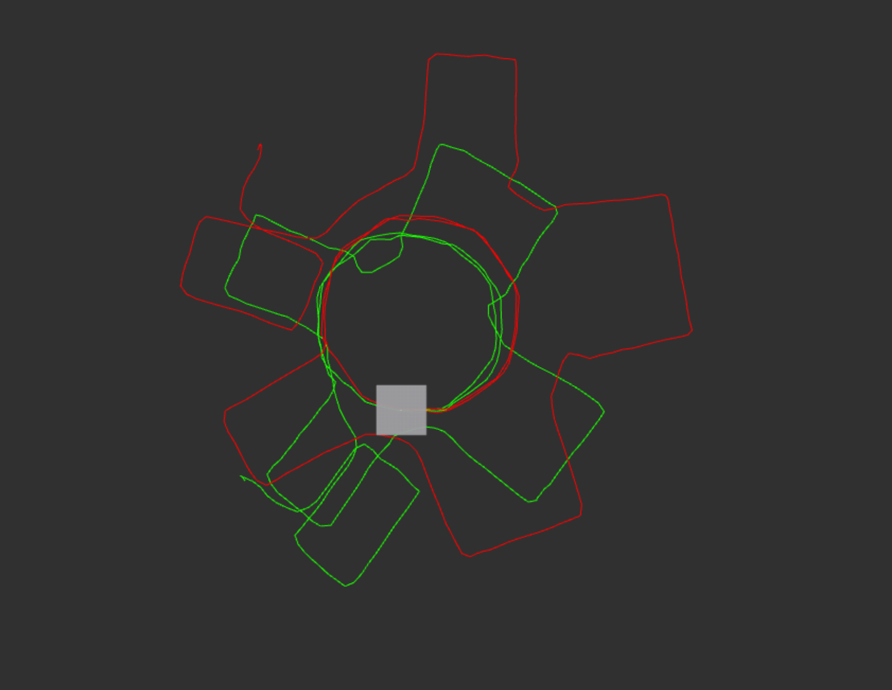
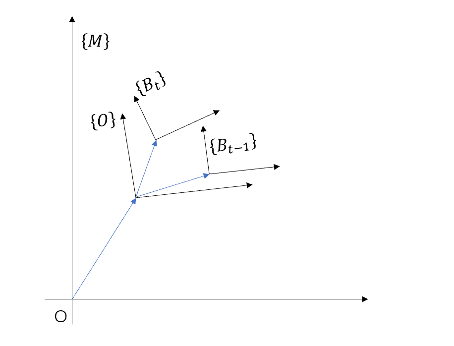
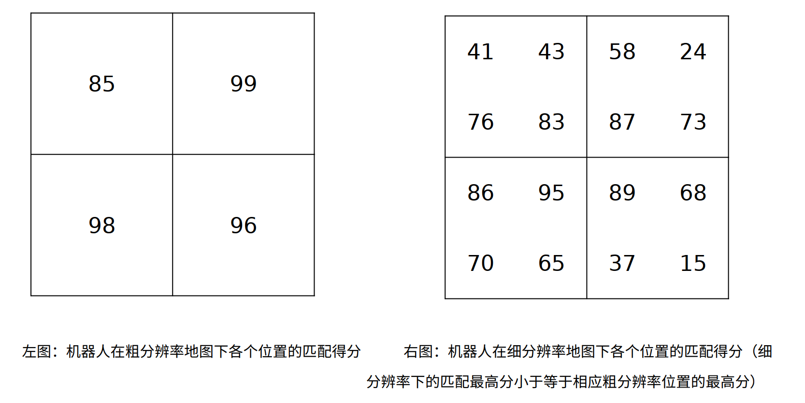

1. > 补充代码，实现 gaussian_newton_scanmatcher 模块；（6 分）
  
   1. 在地图上的进行插值，得到coords处的势场值和对应的关于位置的梯度；
  
      ```cpp
      //TODO
      int map_index_x = floor((coords[0] - map->origin_x) / map->resolution) + map->size_x / 2;
      int map_index_y = floor((coords[1] - map->origin_y) / map->resolution) + map->size_y / 2;
      if(MAP_VALID(map, map_index_x, map_index_y) && MAP_VALID(map, map_index_x + 1, map_index_y)
         && MAP_VALID(map, map_index_x + 1, map_index_y + 1) && MAP_VALID(map, map_index_x, map_index_y + 1))
      {
         int index1 = MAP_INDEX(map, map_index_x, map_index_y);
         double score1 = (map->cells+index1)->score;
         int index2 = MAP_INDEX(map, map_index_x + 1, map_index_y);
         double score2 = (map->cells+index2)->score;
         int index3 = MAP_INDEX(map, map_index_x + 1, map_index_y + 1);
         double score3 = (map->cells+index3)->score;
         int index4 = MAP_INDEX(map, map_index_x, map_index_y + 1);
         double score4 = (map->cells+index4)->score;

         double world_coords_x0 = MAP_WXGX(map, map_index_x);
         double world_coords_y0 = MAP_WYGY(map, map_index_y);
         double world_coords_x1 = MAP_WXGX(map, map_index_x + 1);
         double world_coords_y1 = MAP_WYGY(map, map_index_y + 1);

         ans[0] = (coords[0] - world_coords_x1)/(world_coords_x0 - world_coords_x1) * (coords[1] 
            - world_coords_y1)/(world_coords_y0 - world_coords_y1) * score1 
            + (coords[0] - world_coords_x0)/(world_coords_x1 - world_coords_x0) * (coords[1] 
            - world_coords_y1)/(world_coords_y0 - world_coords_y1) * score2 
            + (coords[0] - world_coords_x0)/(world_coords_x1 - world_coords_x0) * (coords[1] 
            - world_coords_y0)/(world_coords_y1 - world_coords_y0) * score3 
            + (coords[0] - world_coords_x1)/(world_coords_x0 - world_coords_x1) * (coords[1] 
            - world_coords_y0)/(world_coords_y1 - world_coords_y0) * score4;
         ans[1] = 1/(world_coords_x0 - world_coords_x1) * (coords[1] - world_coords_y1)
            /(world_coords_y0 - world_coords_y1) * score1 
            + 1/(world_coords_x1 - world_coords_x0) * (coords[1] - world_coords_y1)
            /(world_coords_y0 - world_coords_y1) * score2 
            + 1/(world_coords_x1 - world_coords_x0) * (coords[1] - world_coords_y0)
            /(world_coords_y1 - world_coords_y0) * score3 
            + 1/(world_coords_x0 - world_coords_x1) * (coords[1] - world_coords_y0)
            /(world_coords_y1 - world_coords_y0) * score4;
         ans[2] = (coords[0] - world_coords_x1)/(world_coords_x0 - world_coords_x1) 
            * 1/(world_coords_y0 - world_coords_y1) * score1 
            + (coords[0] - world_coords_x0)/(world_coords_x1 - world_coords_x0) 
            * 1/(world_coords_y0 - world_coords_y1) * score2 
            + (coords[0] - world_coords_x0)/(world_coords_x1 - world_coords_x0) 
            * 1/(world_coords_y1 - world_coords_y0) * score3 
            + (coords[0] - world_coords_x1)/(world_coords_x0 - world_coords_x1) 
            * 1/(world_coords_y1 - world_coords_y0) * score4;
      }else{
         std::cerr << "coords is invalid, the given map coords lie without the absolute map bounds!!!" << std::endl;
      }
      //END OF TODO
      ```
  
   2. 计算H*dx = b中的H和b；
  
      ```cpp
      //TODO
      for(auto point : laser_pts)
      {
         // std::cout << "ComputeHessianAndb start" << std::endl;
         Eigen::Matrix3d Trans = GN_V2T(now_pose);
         Eigen::Vector2d world_pt = GN_TransPoint(point, Trans);
         Eigen::Vector3d res = InterpMapValueWithDerivatives(map, world_pt);
         // std::cout << "ComputeHessianAndb end" << std::endl;
         // std::cout << "res: " << res << std::endl;
         Eigen::MatrixXd nabla_M(1, 2);
         nabla_M << res[1], res[2];
         Eigen::MatrixXd diff_S_T(2, 3);
         diff_S_T << 1, 0, -sin(now_pose[2])*point[0] - cos(now_pose[2])*point[1],
                     0, 1, cos(now_pose[2])*point[0] - sin(now_pose[2])*point[1];
         Eigen::MatrixXd J_tmp(1, 3);
         J_tmp = nabla_M * diff_S_T;
         H += J_tmp.transpose() * J_tmp;
         b += J_tmp.transpose() * (1 - res[0]);
      }
      //END OF TODO
      ```

   3. 进行高斯牛顿优化。

      ```cpp
      //TODO
      Eigen::Matrix3d H;
      Eigen::Vector3d b;
      ComputeHessianAndb(map, now_pose, laser_pts, H, b);
      // Verify that H isn't singular
      Eigen::JacobiSVD<Eigen::MatrixXd> svd(H);
      double cond = svd.singularValues()(0) / svd.singularValues()(svd.singularValues().size() - 1);
      if (cond <= 1000)
      {
         Eigen::Vector3d delta_T;
         delta_T = H.colPivHouseholderQr().solve(b);
         if(std::fabs(delta_T(2)) >= 0.17)
         {
               std::cout << "delta_T[2] is too large!!!" << std::endl;
               break;
         }
         now_pose += delta_T;
         //迭代条件是否满足
         if(std::sqrt( std::pow(delta_T(0),2) + std::pow(delta_T(1),2)) < 0.001 && delta_T(2) < (0.01/57.295))
         {
               std::cout << "delta_T is too small, break" << std::endl;
               break;
         }
      }else{
         std::cout << "Matrix H is almost singular." << "cond: " << cond << std::endl;
         break;
      }
      //END OF TODO
      ```
  
   运行结果如下图所示（红色为里程计路径，绿色为高斯牛顿优化法得到的路径）：  
   

   *这里可以参考下hector slam的开源代码。写作业过程中碰到了好多坑，这里记录下。代码中计算高斯牛顿前有一段坐标变换可以自己推导下；代码中的函数 `MAP_GYWY()` 会四舍五入，需要自己写；求解结果delat_T并不需要坐标转换，直接加到T上就行；`ComputeHessianAndb()` 函数中有用激光点相对世界坐标系的表示，也有用相对激光基坐标的表示要搞清楚；求解过程中H矩阵可能为奇异矩阵、病态矩阵、delat_T步长太大的问题；cpu可能会跑满，需要优化代码，或者换性能好一些的电脑，实在不行也可以慢放数据或者优化代码减少cpu占用，但是优化后发现代码里的步长设置不合理，需要修改步长，真是碰到好多坑呀o(╥﹏╥)o。*  
   PS：这里有个坐标变换还是比较巧妙的，当时也研究了一会，如下所示：
   ```cpp
      //初始解为上一帧激光位姿+运动增量
      Eigen::Vector3d deltaPose = nowPose - m_odomPath.back();
      deltaPose(2) = GN_NormalizationAngle(deltaPose(2));

      Eigen::Matrix3d R_laser;
      double theta = m_prevLaserPose(2);
      R_laser << cos(theta), -sin(theta), 0, 
                  sin(theta),  cos(theta), 0,
                     0,          0,      1;

      Eigen::Matrix3d R_odom;
      theta = m_odomPath.back()(2);
      R_odom << cos(theta), -sin(theta), 0, 
               sin(theta),  cos(theta), 0,
                     0,          0,      1;
      Eigen::Vector3d finalPose = m_prevLaserPose + R_laser * R_odom.transpose() * deltaPose;
   ```
   ros中的坐标系需要先说明下，base_link是机器人的基坐标系，与机器人刚性相连，由于传感器安装在机器人上，所以这些传感器一般与base_link有个固定的转换关系（base_link是传感器坐标系的父坐标系）；odom为里程计坐标系，室内移动机器人一般使用轮式里程计，可以认为，在odom坐标系中，机器人的运动是连续的，平滑的，没有跳变的，然而odom存在累计误差，在短时间内比较有参考意义，不能作为长期参考；map是我们认为的世界坐标系，一般情况下，会根据传感器的信息消除累计误差重新定位（计算的为map到base_link变换，但不直接发布），这意味着在map坐标系中，机器人的位姿可能会发生跳变，这种跳变对传感器和执行器来说是个不好的参考坐标。在ros中，一个坐标系只能有一个父坐标，所以map坐标系是odom坐标系的父；odom坐标系是base_link坐标系的父；base_link坐标系是其他传感器的坐标系的父，比如laser_link。记为 `map --> odom --> base_link --> laser_link` 。  
   回到代码，这里的 `nowPose` 是机器人当前时刻的odom坐标 $^O_{B_t}T$ ， `m_odomPath.back()` 是机器人上一时刻的odom坐标 $^O_{B_{t-1}}T$ ， `m_prevLaserPose` 是机器人上一时刻的map坐标 $^M_{B_{t-1}}T$ （这里激光雷达传感器的坐标系laser_link和base_link坐标系重合，且使用高斯牛顿法修正后可以认为消除了累计误差，就是我们认为的基于map坐标系的坐标），求的是 `finalPose` ，即当前时刻机器人的map坐标 $^M_{B_t}T$ ，如下图所示：  
   
   接着推导一下：
   $$
      \begin{aligned}
      ^M_{B_t}T&=^M_{B_{t-1}}T\cdot^{B_{t-1}}_{B_t}T \\[2ex]
      &=^M_{B_{t-1}}T\cdot^{B_{t-1}}_OT\cdot^O_{B_t}T \\[2ex]
      &=^M_{B_{t-1}}T\cdot^O_{B_{t-1}}T^{-1}\cdot^O_{B_t}T \\[2ex]
      &=\begin{bmatrix}
      ^M_{B_{t-1}}R & ^M_{B_{t-1}}t \\
      0 & 1 \\
      \end{bmatrix}\cdot\begin{bmatrix}
      ^O_{B_{t-1}}R^T & -^O_{B_{t-1}}R^T\cdot^O_{B_{t-1}}t \\
      0 & 1 \\
      \end{bmatrix}\cdot\begin{bmatrix}
      ^O_{B_t}R & ^O_{B_t}t \\
      0 & 1 \\
      \end{bmatrix} \\[2ex]

      &=\begin{bmatrix}
      ^M_{B_{t-1}}R & ^M_{B_{t-1}}t \\
      0 & 1 \\
      \end{bmatrix}\cdot\begin{bmatrix}
      ^O_{B_{t-1}}R^T\cdot^O_{B_t}R & ^O_{B_{t-1}}R^T\cdot^O_{B_t}t-^O_{B_{t-1}}R^T\cdot^O_{B_{t-1}}t \\
      0 & 1 \\
      \end{bmatrix} \\[2ex]

      &=\begin{bmatrix}
      ^M_{B_{t-1}}R & ^M_{B_{t-1}}t \\
      0 & 1 \\
      \end{bmatrix}\cdot\begin{bmatrix}
      ^O_{B_{t-1}}R^T\cdot^O_{B_t}R & ^O_{B_{t-1}}R^T\cdot(^O_{B_t}t-^O_{B_{t-1}}t) \\
      0 & 1 \\
      \end{bmatrix} \\[2ex]

      &=\begin{bmatrix}
      ^M_{B_{t-1}}R\cdot^O_{B_{t-1}}R^T\cdot^O_{B_t}R & ^M_{B_{t-1}}R\cdot^O_{B_{t-1}}R^T\cdot(^O_{B_t}t-^O_{B_{t-1}}t)+^M_{B_{t-1}}t \\
      0 & 1 \\
      \end{bmatrix} \\[2ex]
      \end{aligned}
   $$
   这里只推导出了平移部分，但是上面的代码中角度也直接算出来了，二维平面的角度计算跟我们之前的感觉也相符（不求逆加上那个角度，求逆就减去那个角度，画个图更直观），比较正式的推导没有找到，以后多注意（群论？）。  
  
2. > 简答题，开放性答案：提出一种能提升第一题激光匹配轨迹精度的方法，并解释原因；（2 分）
  
   可以用LM法来代替GN法求解上述非线性最小二乘。由于我们所用的 $H$ 矩阵存在可能为奇异矩阵或者病态 (illcondition) 的情况，此时增量的稳定性较差，导致算法不收敛。更严重的是，就算我们假设 $H$ 非奇异也非病态，如果我们求出来的步长 $\Delta x$ 太大，也会导致我们采用的局部近似（一阶泰勒展开）不够准确，这样一来我们甚至都无法保证它的迭代收敛，哪怕是让目标函数变得更大都是有可能的。  
   Levenberg-Marquadt 方法在一定程度上修正了这些问题，该方法的简化形式为 $(H + \lambda I) \Delta x = g$ ，我们看到，当参数 $\lambda$ 比较小时， $H$ 占主要地位，这说明二次近似模型在该范围内是比较好的， LM 方法更接近于 GN 法。另一方面，当 $\lambda$ 比较大时， $\lambda I$ 占据主要地位， LM更接近于一阶梯度下降法（即最速下降），这说明附近的二次近似不够好。LM 的求解方式，可在一定程度上避免线性方程组的系数矩阵的非奇异和病态问题，提供更稳定更准确的增量 $\Delta x$。  
   也可以就高斯牛顿法和代码本身就行优化，可以优化代码步长；优化代码，减少cpu占用；增加迭代次数；等等。
  
3. > 阅读论文 The Normal Distributions Transform: A New Approach to Laser Scan Matching，回答以下问题：（2 分）
   1. > NDT 的优化函数（score）是什么？
  
      $$
      score(\boldsymbol{p})=\sum_{i}\operatorname{exp}(\frac{-(\boldsymbol{x}'_i-\boldsymbol{q}_i)^t\boldsymbol{\Sigma}^{-1}_i(\boldsymbol{x}'_i-\boldsymbol{q}_i)}{2})
      $$
      其中：  
      $\boldsymbol{p}=(p_i)^t_{i=1\dots3}=(t_x, t_y, \phi)^t$ 为需要求解的位姿； $\boldsymbol{x}_i$ 为激光点基于激光坐标系的坐标； $\boldsymbol{x}'_i$ 为激光点基于世界坐标系的坐标（经过 $\boldsymbol{p}$ 变换）； $\boldsymbol{q}_i$ 和 $\boldsymbol{\Sigma}_i$ 分别为 $\boldsymbol{x}'_i$ 的均值和方差。
  
   2. > 简述 NDT 根据 score 函数进行优化求解的过程。
  
      需要求 $score$ 的最大值，优化问题一般是求最小值，转化为 $-score$ 来求最小值。 $score$ 是高斯分布，要求 $-score$ 的最小值，即为求 $-score$ 导数为 $0$ 。  
      令 $f(x)=-score$ ， $g(x)=f'(x)$ 。  
      $g(x)$ 进行一阶泰勒展开：  
      $$
      g(x+\Delta x)=g(x)+g'(x)\Delta x=0 \\[2ex]
      g'(x)\Delta x=-g(x) \\[2ex]
      H\Delta x=-g \\
      $$
      求解得到 $\Delta x$ 后加到 $x$ 上，继续代入上述步骤，迭代求解知道满足条件。
      下面来求解 $g$ 和 $H$ ，令 $\boldsymbol{q}=\boldsymbol{x}'_i-\boldsymbol{q}_i$ ：
      $$
      f=-\operatorname{exp}(\frac{-\boldsymbol{q}^t\boldsymbol{\Sigma}^{-1}\boldsymbol{q}}{2}) \\[2ex]
      g=\frac{\partial f}{\partial\boldsymbol{p}}=-\operatorname{exp}(\frac{-\boldsymbol{q}^t\boldsymbol{\Sigma}^{-1}\boldsymbol{q}}{2})(-\boldsymbol{q}^t\boldsymbol{\Sigma}^{-1})\frac{\partial\boldsymbol{q}}{\partial\boldsymbol{p}} \\[2ex]
      H=\frac{\partial g}{\partial\boldsymbol{p}}=-\operatorname{exp}(\frac{-\boldsymbol{q}^t\boldsymbol{\Sigma}^{-1}\boldsymbol{q}}{2})(-\boldsymbol{q}^t\boldsymbol{\Sigma}^{-1}\frac{\partial\boldsymbol{q}}{\partial\boldsymbol{p}})(-\boldsymbol{q}^t\boldsymbol{\Sigma}^{-1}\frac{\partial\boldsymbol{q}}{\partial\boldsymbol{p}})-\operatorname{exp}(\frac{-\boldsymbol{q}^t\boldsymbol{\Sigma}^{-1}\boldsymbol{q}}{2})(-\frac{\partial\boldsymbol{q}^t}{\partial\boldsymbol{p}}\boldsymbol{\Sigma}^{-1}\frac{\partial\boldsymbol{q}}{\partial\boldsymbol{p}})-\operatorname{exp}(\frac{-\boldsymbol{q}^t\boldsymbol{\Sigma}^{-1}\boldsymbol{q}}{2})(-\boldsymbol{q}^t\boldsymbol{\Sigma}^{-1}\frac{{\partial}^2\boldsymbol{q}}{\partial\boldsymbol{p}^2})
      $$
      其中，
      $$
      \frac{\partial\boldsymbol{q}}{\partial\boldsymbol{p}}=\begin{bmatrix}
         1 & 0 & -x\sin\phi-y\cos\phi \\
         0 & 1 & x\cos\phi-y\sin\phi
      \end{bmatrix} \\[2ex]
      \frac{{\partial}^2\boldsymbol{q}}{\partial p_i\partial p_j}=f(n) =
         \begin{cases}
               \begin{bmatrix}
                  -x\cos\phi+y\sin\phi \\
                  -x\sin\phi-y\cos\phi
               \end{bmatrix}  & \text{i=j=3} \\[2ex]
               \begin{bmatrix}
                  0 \\
                  0
               \end{bmatrix} & \text{otherwise} \\[2ex]
         \end{cases} \\[2ex]
      $$
  
4. > 机器人在 XY 方向上进行 CSM 匹配。下图左为机器人在目标区域粗分辨率下 4 个位置的匹配得分，得分越高说明机器人在该位置匹配的越好，下图右为机器人在同一块地图细分辨率下每个位置的匹配得分（右图左上 4 个小格对应左图左上一个大格，其它同理）。如果利用分枝定界方法获取最终细分辨率下机器人的最佳匹配位置，请简述匹配和剪枝流程。（2 分）

  
   第一步，遍历粗分辨率下4个位置，此时 $best\_score=-\infin$ ，第一次选取最大的99分粗分辨率节点；  
   第二步，选取的99分粗分辨率节点为跟节点，进行分枝，进入细分辨率节点，此时为叶子节点，遍历后选取最大的87分的细分辨率节点， $best\_score=87$ ；  
   第三步，返回粗分辨率节点，第一个节点是85分，小于 $best\_score$ ，剪枝；  
   第四步，在粗分辨率节点继续查找，目前循环到第三节点，该节点为98分，大于 $best\_score$ ，进入细分辨率节点，此时为叶子节点，遍历后得到95分节点大于 $best\_score$ ， $best\_score=95$ ；  
   第五步，返回粗分辨率节点继续查找，目前循环到第四节点，该节点为96分，大于 $best\_score$ ，进入细分辨率节点，遍历后所有叶子节点都小于 $best\_score$ ，返回粗分辨率节点，粗分辨率节点为空，结束。
  
   *分枝定界与松弛问题，可以自行查看最优化问题相关内容。*  