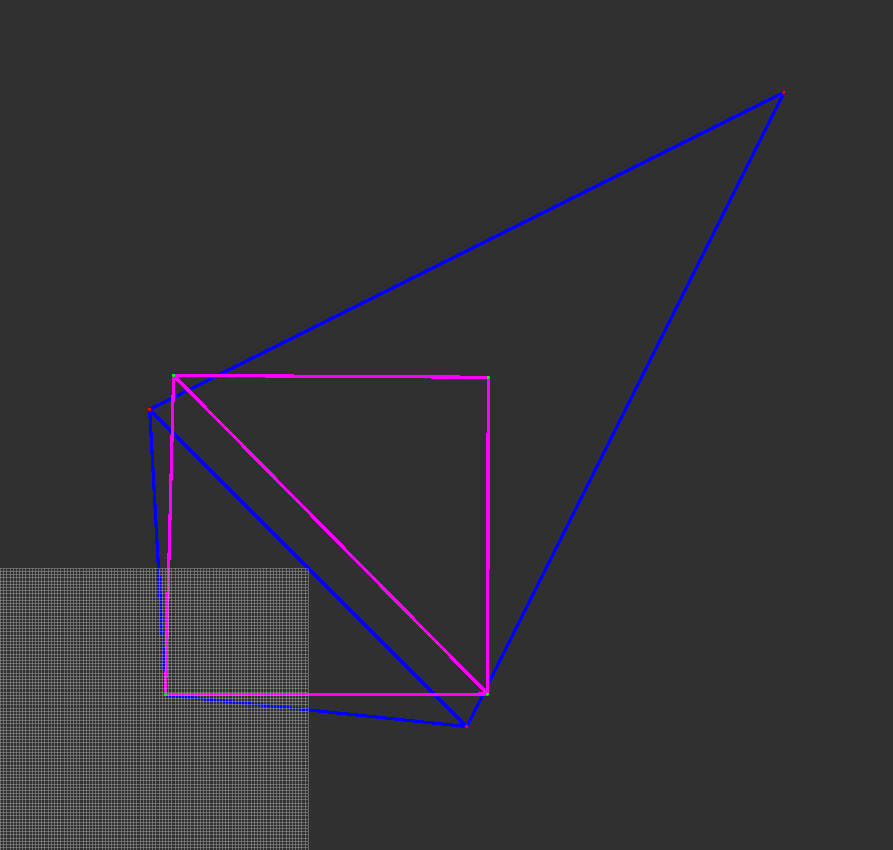
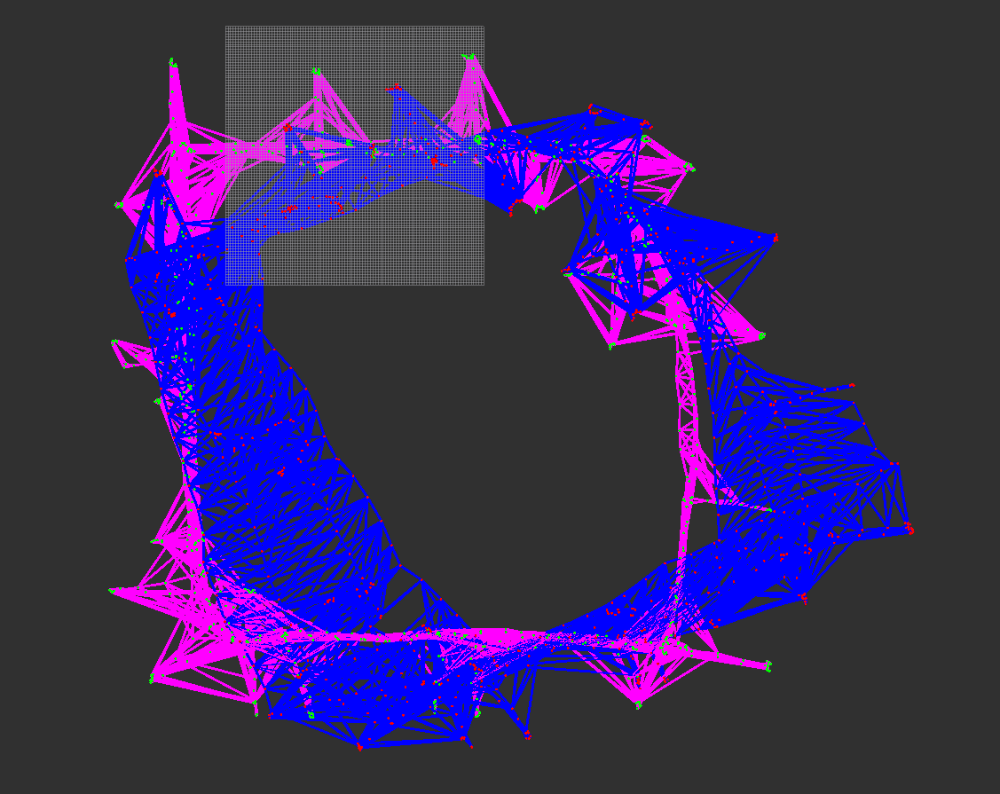
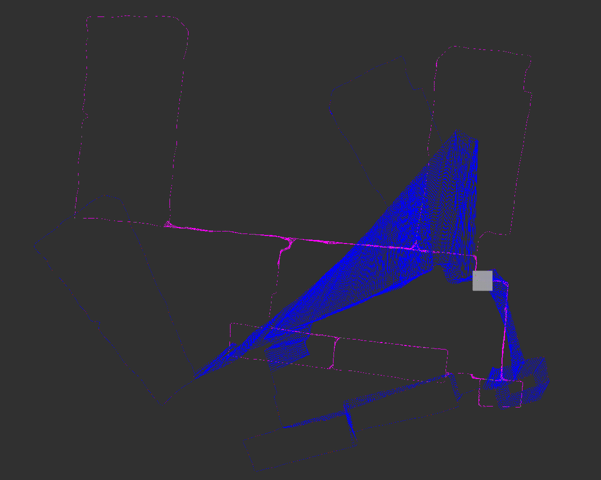
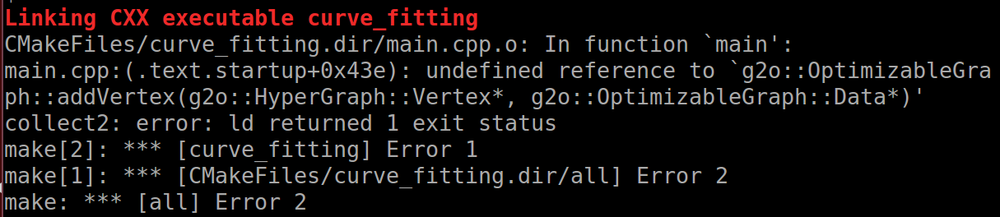

1. > 补充代码，实现高斯牛顿方法对 Pose-Graph 进行优化；（6 分）  
  
    1. 计算jacobian矩阵和error；  
  
        ```cpp
        //TODO--Start
        // Eigen::Matrix3d zij = PoseToTrans(xi).inverse() * PoseToTrans(xj);
        // Eigen::Vector3d eij = TransToPose(PoseToTrans(z).inverse() * zij);
        Eigen::Matrix2d RijT;
        RijT << cos(z(2)),sin(z(2)),
            -sin(z(2)),cos(z(2));
        Eigen::Matrix2d RiT;
        RiT << cos(xi(2)),sin(xi(2)),
            -sin(xi(2)),cos(xi(2));
        Eigen::Matrix2d dRiT;
        dRiT << -sin(xi(2)), cos(xi(2)),
                -cos(xi(2)),-sin(xi(2));

        ei.block(0, 0, 2, 1) = RijT * (RiT * (xj.block(0, 0, 2, 1) - xi.block(0, 0, 2, 1)) - z.block(0, 0, 2, 1));
        ei(2) = xj(2) - xi(2) - z(2);
        if (ei(2) > M_PI)
            ei(2) -= 2 * M_PI;
        else if (ei(2) < -M_PI)
            ei(2) += 2 * M_PI;
        Ai.block(0, 0, 2, 2) = - RijT * RiT;
        Ai.block(0, 2, 2, 1) = RijT * dRiT * (xj.block(0, 0, 2, 1) - xi.block(0, 0, 2, 1));
        Ai.block(2, 0, 1, 3) << 0, 0, -1;
        Bi.setIdentity();
        Bi.block(0, 0, 2, 2) = RijT * RiT;
        //TODO--end
        ```
  
    2. 构造H矩阵和b向量以及求解；  
  
        ```cpp
        //构造H矩阵　＆ b向量
        for(int i = 0; i < Edges.size();i++)
        {
            //提取信息
            Edge tmpEdge = Edges[i];
            Eigen::Vector3d xi = Vertexs[tmpEdge.xi];
            Eigen::Vector3d xj = Vertexs[tmpEdge.xj];
            Eigen::Vector3d z = tmpEdge.measurement;
            Eigen::Matrix3d infoMatrix = tmpEdge.infoMatrix;

            //计算误差和对应的Jacobian
            Eigen::Vector3d ei;
            Eigen::Matrix3d Ai;
            Eigen::Matrix3d Bi;
            CalcJacobianAndError(xi,xj,z,ei,Ai,Bi);

            //TODO--Start
            b.block(3*tmpEdge.xi, 0, 3, 1) += Ai.transpose() * infoMatrix * ei;
            b.block(3*tmpEdge.xj, 0, 3, 1) += Bi.transpose() * infoMatrix * ei;
            H.block(3*tmpEdge.xi, 3*tmpEdge.xi, 3, 3) += Ai.transpose() * infoMatrix * Ai;
            H.block(3*tmpEdge.xi, 3*tmpEdge.xj, 3, 3) += Ai.transpose() * infoMatrix * Bi;
            H.block(3*tmpEdge.xj, 3*tmpEdge.xi, 3, 3) += Bi.transpose() * infoMatrix * Ai;
            H.block(3*tmpEdge.xj, 3*tmpEdge.xj, 3, 3) += Bi.transpose() * infoMatrix * Bi;
            //TODO--End
        }

        //求解
        Eigen::VectorXd dx;
        //TODO--Start
        dx = H.colPivHouseholderQr().solve(-b);
        // dx = H.llt().solve(-b);
        //TODO-End
        ```
  
    3. 更新x。
  
        ```cpp
        //TODO--Start
        for(int j = 0; j < Vertexs.size(); ++j)
        {
            //when j = 0, delta x = 0, I should check
            Vertexs[j](0) += dx(j*3);
            Vertexs[j](1) += dx(j*3+1);
            Vertexs[j](2) += dx(j*3+2);
            if (Vertexs[j](2) > M_PI)
                Vertexs[j](2) -= 2 * M_PI;
            else if (Vertexs[j](2) < -M_PI)
                Vertexs[j](2) += 2 * M_PI;
        }
        //TODO--End
        ```
  
    三组数据运行结果如下所示：  
    test_quadrat数据集：  
    ```sh
        $ rosrun ls_slam ls_slam 
        Edges:5
        initError:251853
        Iterations:0
        Iterations:1
        Iterations:2
        FinalError:49356.5
    ```
    
  
    intel数据集：  
    ```sh
        $ rosrun ls_slam ls_slam 
        Edges:3070
        initError:2.05092e+06
        Iterations:0
        Iterations:1
        Iterations:2
        Iterations:3
        Iterations:4
        FinalError:65.402
    ```
    
  
    killian数据集：  
    ```sh
        $ rosrun ls_slam ls_slam 
        Edges:3995
        initError:3.08592e+08
        Iterations:0
        Iterations:1
        Iterations:2
        Iterations:3
        Iterations:4
        Iterations:5
        FinalError:10344.7
    ```
    
  
2. > 简答题，开放性答案：你认为第一题的优化过程中哪个环节耗时最多？是否有什么改进的方法可以进行加速？（2 分）
  
    加入测试代码：  
    在求解位置加入测试代码，如下：  
    ```cpp
        //求解
        Eigen::VectorXd dx;
        auto last_time = std::chrono::high_resolution_clock::now();
        //TODO--Start
        dx = H.colPivHouseholderQr().solve(-b);
        //TODO-End
        auto current_time = std::chrono::high_resolution_clock::now();
        std::cout  << "solve time(ms): " << std::chrono::duration_cast<std::chrono::milliseconds>(current_time - last_time).count() << std::endl;
    ```
  
    在迭代处加入测试代码，求总耗时：  
    ```cpp
        auto last_time = std::chrono::high_resolution_clock::now();
        for(int i = 0; i < maxIteration;i++)
        {
            std::cout <<"Iterations:"<<i<<std::endl;
            Eigen::VectorXd dx = LinearizeAndSolve(Vertexs,Edges);

            //进行更新
            //TODO--Start
            for(int j = 0; j < Vertexs.size(); ++j)
            {
                //when j = 0, delta x = 0, I should check
                Vertexs[j](0) += dx(j*3);
                Vertexs[j](1) += dx(j*3+1);
                Vertexs[j](2) += dx(j*3+2);
                if (Vertexs[j](2) > M_PI)
                    Vertexs[j](2) -= 2 * M_PI;
                else if (Vertexs[j](2) < -M_PI)
                    Vertexs[j](2) += 2 * M_PI;
            }
            //TODO--End

            double maxError = -1;
            for(int k = 0; k < 3 * Vertexs.size();k++)
            {
                if(maxError < std::fabs(dx(k)))
                {
                    maxError = std::fabs(dx(k));
                }
            }

            if(maxError < epsilon)
                break;
        }
        auto current_time = std::chrono::high_resolution_clock::now();
        std::cout  << "all time(ms): " << std::chrono::duration_cast<std::chrono::milliseconds>(current_time - last_time).count() << std::endl;
    ```
  
    以intel数据集作为测试数据集：  
    ```sh
        $ rosrun ls_slam ls_slam 
        Edges:3070
        initError:2.05092e+06
        Iterations:0
        solve time(ms): 145168
        Iterations:1
        solve time(ms): 145980
        Iterations:2
        solve time(ms): 148969
        Iterations:3
        solve time(ms): 143156
        Iterations:4
        solve time(ms): 143954
        all time(ms): 727791
        FinalError:65.402
    ```
    经过测试可知，总共迭代5次，求解过程耗时727227ms，总耗时727791ms，除求解过程其他耗时564ms，所以求解过程耗时最多。  
    加速方法：求解过程加速，H为稀疏矩阵，可以使用eigen中的稀疏矩阵求解器进行求解；求解J矩阵加速，可以使用openmp进行多线程加速。  
  
    使用稀疏矩阵求解器进行求解，修改代码如下：  
    ```cpp
        //求解
        Eigen::VectorXd dx;
        auto last_time = std::chrono::high_resolution_clock::now();
        //TODO--Start
        Eigen::SimplicialCholesky<Eigen::SparseMatrix<double> > solver;
        Eigen::SparseMatrix<double> A = H.sparseView();
        dx = solver.compute(A).solve(-b);
        //TODO-End
    ```
    运行结果如下所示：  
    ```sh
        $ rosrun ls_slam ls_slam 
        Edges:3070
        initError:2.05092e+06
        Iterations:0
        solve time(ms): 93
        Iterations:1
        solve time(ms): 95
        Iterations:2
        solve time(ms): 93
        Iterations:3
        solve time(ms): 94
        Iterations:4
        solve time(ms): 93
        all time(ms): 999
        FinalError:65.402
    ```
    总共迭代5次，求解过程耗时468ms，总耗时999ms，除求解过程其他耗时531ms，求解过程耗时大大减少。  
  
    *附上eigen中的[稀疏矩阵求解函数链接](http://eigen.tuxfamily.org/dox/group__TopicSparseSystems.html)。*  
  
3. > 学习相关材料。除了高斯牛顿方法，你还知道哪些非线性优化方法？请简述它们的原理；（2 分）
  
    除了高斯牛顿法（GN法），还有一阶（最速下降法）和二阶（牛顿法）梯度法以及列文伯格-马夸尔特算法（LM法）。  
    将目标函数在 $x$ 附近进行泰勒展开，如果保留一阶梯度，那么增量的方向为：  
    $$
    \Delta x^*=-J^T(x)
    $$
    如果保留二阶梯度信息，增量的解为：  
    $$
    H\Delta x=-J^T
    $$
    最速下降法过于贪心，容易走出锯齿路线，反而增加了迭代次数。而牛顿法则需要计算目标函数的 $H$ 矩阵，这在问题规模较大时非常困难，我们通常倾向于避免 $H$ 的计算。  
    高斯牛顿法它的思想是将 $f(x)$ 进行一阶的泰勒展开（请注意不是目标函数 $f(x)^2$ ），最终得到增量方程为：  
    $$
    J^T(x)J(x)\Delta x=-J^T(x)f(x)
    $$
    对比牛顿法可见， 高斯牛顿法用 $J^TJ$ 作为牛顿法中二阶 Hessian 矩阵的近似，从而省略了计算 $H$ 的过程。然而 $H$ 矩阵存在可能为奇异矩阵或者病态 (illcondition) 的情况，此时增量的稳定性较差，导致算法不收敛。更严重的是，就算我们假设 $H$ 非奇异也非病态，如果我们求出来的步长 $\Delta x$ 太大，也会导致我们采用的局部近似（一阶泰勒展开）不够准确，这样一来我们甚至都无法保证它的迭代收敛，哪怕是让目标函数变得更大都是有可能的。  
    Levenberg-Marquadt 方法在一定程度上修正了这些问题，该方法的简化形式为：
    $$
    (H + \lambda I) \Delta x = g
    $$
    我们看到，当参数 $\lambda$ 比较小时， $H$ 占主要地位，这说明二次近似模型在该范围内是比较好的， LM 方法更接近于 GN 法。另一方面，当 $\lambda$ 比较大时， $\lambda I$ 占据主要地位， LM更接近于一阶梯度下降法（即最速下降），这说明附近的二次近似不够好。LM 的求解方式，可在一定程度上避免线性方程组的系数矩阵的非奇异和病态问题，提供更稳定更准确的增量 $\Delta x$。  
  
4. > 将第一题改为使用任意一种非线性优化库进行优化（比如 Ceres, Gtsam 或 G2o 等）。（2 分）
  
    1. 将第一题使用G2O进行优化，使用顶点g2o::VertexSE2，边g2o::EdgeSE2，插入代码如下：  
  
        ```cpp
            double initError = ComputeError(Vertexs,Edges);
            std::cout <<"initError:"<<initError<<std::endl;

            auto last_time = std::chrono::high_resolution_clock::now();
            typedef g2o::BlockSolver<g2o::BlockSolverTraits<3, 3>> Block; // 每个误差项优化变量维度为3，误差值维度为3
            Block::LinearSolverType* linearSolver = new g2o::LinearSolverCSparse<Block::PoseMatrixType>();
            Block* solver_ptr = new Block(linearSolver);
            g2o::OptimizationAlgorithmGaussNewton* solver = new g2o::OptimizationAlgorithmGaussNewton( solver_ptr );
            g2o::SparseOptimizer optimizer;
            optimizer.setAlgorithm(solver);

            for (size_t i = 0; i < Vertexs.size(); i++) {
                VertexSE2* v = new VertexSE2();
                v->setEstimate(Vertexs[i]);
                v->setId(i);
                if (i == 0) {
                    v->setFixed(true);
                }
                optimizer.addVertex(v);
            }

            for (size_t i = 0; i < Edges.size(); i++) {
                EdgeSE2* edge = new EdgeSE2();

                Edge tmpEdge = Edges[i];

                edge->setId(i);
                edge->setVertex(0, optimizer.vertices()[tmpEdge.xi]);
                edge->setVertex(1, optimizer.vertices()[tmpEdge.xj]);

                edge->setMeasurement(tmpEdge.measurement);
                edge->setInformation(tmpEdge.infoMatrix);
                optimizer.addEdge(edge);
            }

            optimizer.setVerbose(true);
            optimizer.initializeOptimization();
            SparseOptimizerTerminateAction* terminateAction = new SparseOptimizerTerminateAction;
            terminateAction->setGainThreshold(1e-4);
            optimizer.addPostIterationAction(terminateAction);
            optimizer.optimize(100);

            for (size_t i = 0; i < Vertexs.size(); i++) {
                VertexSE2* v = static_cast<VertexSE2*>(optimizer.vertices()[i]);
                Vertexs[i] = v->estimate().toVector();
            }
            auto current_time = std::chrono::high_resolution_clock::now();
            std::cout  << "all time(ms): " << std::chrono::duration_cast<std::chrono::milliseconds>(current_time - last_time).count() << std::endl;

            double finalError  = ComputeError(Vertexs,Edges);

            std::cout <<"FinalError:"<<finalError<<std::endl;
        ```
    
        解决编译问题后，运行如下：  
        ```sh
            $ rosrun ls_slam ls_slam 
            Edges:3070
            initError:2.05092e+06
            iteration= 0	 chi2= 365235.618940	 time= 0.00546132	 cumTime= 0.00546132	 edges= 3070	 schur= 0
            iteration= 1	 chi2= 134.648697	 time= 0.00350787	 cumTime= 0.00896919	 edges= 3070	 schur= 0
            iteration= 2	 chi2= 65.402453	 time= 0.00361978	 cumTime= 0.012589	 edges= 3070	 schur= 0
            iteration= 3	 chi2= 65.402048	 time= 0.00415684	 cumTime= 0.0167458	 edges= 3070	 schur= 0
            all time(ms): 28
            FinalError:65.402
        ```
        线性方程求解器设置为CSparse，同样设置为高斯牛顿方法，总共迭代4次（比我们自己的程序少迭代一次，具体原因后面有时间可以查看），总耗时28ms，总耗时比优化后的代码（999ms）再次大幅减少。

    2. 将第一题使用ceres进行优化，参照ceres官方历程代码slam/pose_graph_2d/pose_graph_2d.cc，插入代码如下：  
  
        构建代价函数模型及约束：  
        ```cpp
            // Normalizes the angle in radians between [-pi and pi).
            template <typename T>
            inline T NormalizeAngle(const T& angle_radians) {
            // Use ceres::floor because it is specialized for double and Jet types.
            T two_pi(2.0 * M_PI);
            return angle_radians -
                    two_pi * ceres::floor((angle_radians + T(M_PI)) / two_pi);
            }

            template <typename T>
            Eigen::Matrix<T, 2, 2> RotationMatrix2D(T yaw_radians) {
            const T cos_yaw = ceres::cos(yaw_radians);
            const T sin_yaw = ceres::sin(yaw_radians);

            Eigen::Matrix<T, 2, 2> rotation;
            rotation << cos_yaw, -sin_yaw, sin_yaw, cos_yaw;
            return rotation;
            }

            // Computes the error term for two poses that have a relative pose measurement
            // between them. Let the hat variables be the measurement.
            //
            // residual =  information^{1/2} * [  r_a^T * (p_b - p_a) - \hat{p_ab}   ]
            //                                 [ Normalize(yaw_b - yaw_a - \hat{yaw_ab}) ]
            //
            // where r_a is the rotation matrix that rotates a vector represented in frame A
            // into the global frame, and Normalize(*) ensures the angles are in the range
            // [-pi, pi).
            class PoseGraph2dErrorTerm {
            public:
            PoseGraph2dErrorTerm(double x_ab,
                                double y_ab,
                                double yaw_ab_radians,
                                const Eigen::Matrix3d& sqrt_information)
                : p_ab_(x_ab, y_ab),
                    yaw_ab_radians_(yaw_ab_radians),
                    sqrt_information_(sqrt_information) {}

            template <typename T>
            bool operator()(const T* const x_a,
                            const T* const y_a,
                            const T* const yaw_a,
                            const T* const x_b,
                            const T* const y_b,
                            const T* const yaw_b,
                            T* residuals_ptr) const {
                const Eigen::Matrix<T, 2, 1> p_a(*x_a, *y_a);
                const Eigen::Matrix<T, 2, 1> p_b(*x_b, *y_b);

                Eigen::Map<Eigen::Matrix<T, 3, 1>> residuals_map(residuals_ptr);

                residuals_map.template head<2>() =
                    RotationMatrix2D(*yaw_a).transpose() * (p_b - p_a) - p_ab_.cast<T>();
                residuals_map(2) = NormalizeAngle(
                    (*yaw_b - *yaw_a) - static_cast<T>(yaw_ab_radians_));

                // Scale the residuals by the square root information matrix to account for
                // the measurement uncertainty.
                residuals_map = sqrt_information_.template cast<T>() * residuals_map;

                return true;
            }

            static ceres::CostFunction* Create(double x_ab,
                                                double y_ab,
                                                double yaw_ab_radians,
                                                const Eigen::Matrix3d& sqrt_information) {
                return (new ceres::
                            AutoDiffCostFunction<PoseGraph2dErrorTerm, 3, 1, 1, 1, 1, 1, 1>(
                                new PoseGraph2dErrorTerm(
                                    x_ab, y_ab, yaw_ab_radians, sqrt_information)));
            }

            EIGEN_MAKE_ALIGNED_OPERATOR_NEW

            private:
            // The position of B relative to A in the A frame.
            const Eigen::Vector2d p_ab_;
            // The orientation of frame B relative to frame A.
            const double yaw_ab_radians_;
            // The inverse square root of the measurement covariance matrix.
            const Eigen::Matrix3d sqrt_information_;
            };

            // Defines a local parameterization for updating the angle to be constrained in
            // [-pi to pi).
            class AngleLocalParameterization {
            public:
            template <typename T>
            bool operator()(const T* theta_radians,
                            const T* delta_theta_radians,
                            T* theta_radians_plus_delta) const {
                *theta_radians_plus_delta =
                    NormalizeAngle(*theta_radians + *delta_theta_radians);

                return true;
            }

            static ceres::LocalParameterization* Create() {
                return (new ceres::AutoDiffLocalParameterization<AngleLocalParameterization,
                                                                1,
                                                                1>);
            }
            };
        ```
        
        设定问题及求解：  
        ```cpp
            // 构建最小二乘问题
            ceres::Problem problem;
            ceres::LossFunction* loss_function = NULL;
            ceres::LocalParameterization* angle_local_parameterization =
                AngleLocalParameterization::Create();
            for (int i=0; i < Edges.size(); ++i)
            {
                Edge tmpEdge = Edges[i];


                const Eigen::Matrix3d sqrt_information =
                    tmpEdge.infoMatrix.llt().matrixL();
                // Ceres will take ownership of the pointer.
                ceres::CostFunction* cost_function = PoseGraph2dErrorTerm::Create(
                    tmpEdge.measurement(0), tmpEdge.measurement(1), tmpEdge.measurement(2), sqrt_information);
                problem.AddResidualBlock(cost_function,
                                        loss_function,
                                        &Vertexs[tmpEdge.xi](0),
                                        &Vertexs[tmpEdge.xi](1),
                                        &Vertexs[tmpEdge.xi](2),
                                        &Vertexs[tmpEdge.xj](0),
                                        &Vertexs[tmpEdge.xj](1),
                                        &Vertexs[tmpEdge.xj](2));

                problem.SetParameterization(&Vertexs[tmpEdge.xi](2),
                                            angle_local_parameterization);
                problem.SetParameterization(&Vertexs[tmpEdge.xj](2),
                                            angle_local_parameterization);
            }
            problem.SetParameterBlockConstant(&Vertexs[0](0));
            problem.SetParameterBlockConstant(&Vertexs[0](1));
            problem.SetParameterBlockConstant(&Vertexs[0](2));

            ceres::Solver::Options options;
            options.max_num_iterations = 100;
            options.linear_solver_type = ceres::SPARSE_NORMAL_CHOLESKY;
            options.gradient_tolerance = 10e-4;
            // options.function_tolerance = 10e-4;
            // options.parameter_tolerance = 10e-4;
            options.trust_region_strategy_type = ceres::DOGLEG;

            ceres::Solver::Summary summary;
            ceres::Solve(options, &problem, &summary);

            std::cout << summary.FullReport() << '\n';
        ```
        
        运行结果如下：  
        ```sh
            $ rosrun ls_slam ls_slam 
            Edges:3070
            initError:2.05092e+06

            Solver Summary (v 1.12.0-eigen-(3.2.0)-lapack-suitesparse-(4.2.1)-openmp)

                                                Original                  Reduced
            Parameter blocks                         2187                     2184
            Parameters                               2187                     2184
            Residual blocks                          3070                     3070
            Residual                                 9210                     9210

            Minimizer                        TRUST_REGION

            Sparse linear algebra library    SUITE_SPARSE
            Trust region strategy                  DOGLEG (TRADITIONAL)

                                                    Given                     Used
            Linear solver          SPARSE_NORMAL_CHOLESKY   SPARSE_NORMAL_CHOLESKY
            Threads                                     1                        1
            Linear solver threads                       1                        1
            Linear solver ordering              AUTOMATIC                     2184

            Cost:
            Initial                          1.025461e+06
            Final                            3.270102e+01
            Change                           1.025429e+06

            Minimizer iterations                        5
            Successful steps                            5
            Unsuccessful steps                          0

            Time (in seconds):
            Preprocessor                           0.0034

            Residual evaluation                  0.0027
            Jacobian evaluation                  0.0165
            Linear solver                        0.0134
            Minimizer                              0.0357

            Postprocessor                          0.0001
            Total                                  0.0392

            Termination:                      CONVERGENCE (Gradient tolerance reached. Gradient max norm: 2.573441e-04 <= 1.000000e-03)

            all time(ms): 42
            FinalError:65.402
        ```
        置信域方法可以设置为Levenberg-Marquardt和Dogleg，我设置为Dogleg，总共迭代5次，总耗时42ms，总耗时比使用g2o的略大。  
        Gtsam库后续有时间再尝试。
  
    *碎碎念下碰到的问题：首先碰到一个g2o编译报错问题，如下图所示：
    
    可能是我安装的g2o跟ros的g2o冲突，卸载ros g2o后再重新编译安装g2o就没有报错了，或是复制teb_local_planner的cmake文件cmake_modules/FindG2O.cmake也可以解决；附上一些有用的链接[g2o不同线性方程求解器（LinearSolver）的区别](https://blog.csdn.net/ziliwangmoe/article/details/89399540)、[g2o源码](https://github.com/RainerKuemmerle/g2o)、[高博讲g2o的文章](https://www.cnblogs.com/gaoxiang12/p/5304272.html)、[graph slam学习g2o](https://blog.csdn.net/zyh821351004/article/details/46521319)、[ceres官方主页](http://www.ceres-solver.org/index.html)、[ceres源码](https://github.com/ceres-solver/ceres-solver)、[ceres求解器参数官方说明](http://ceres-solver.org/nnls_solving.html#solver-options)；查找资料发现，g2o官方资料比较少，但是源码中的例子很多，我使用的顶点和边都是取自源码，碰到问题可以翻翻源码，ceres的官方资料很全，图优化问题也有官方的实现。*  
  