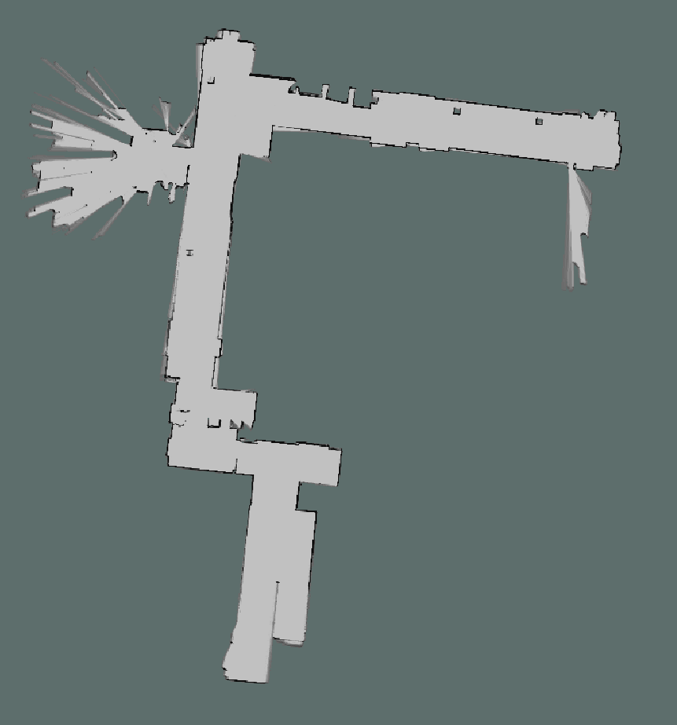
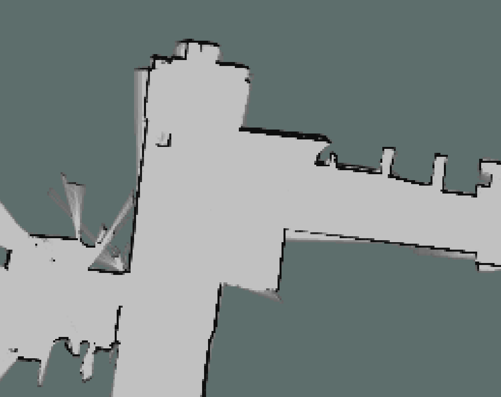
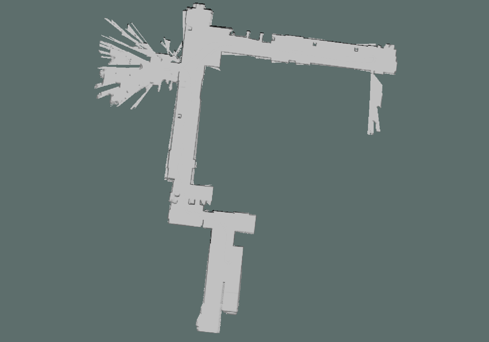
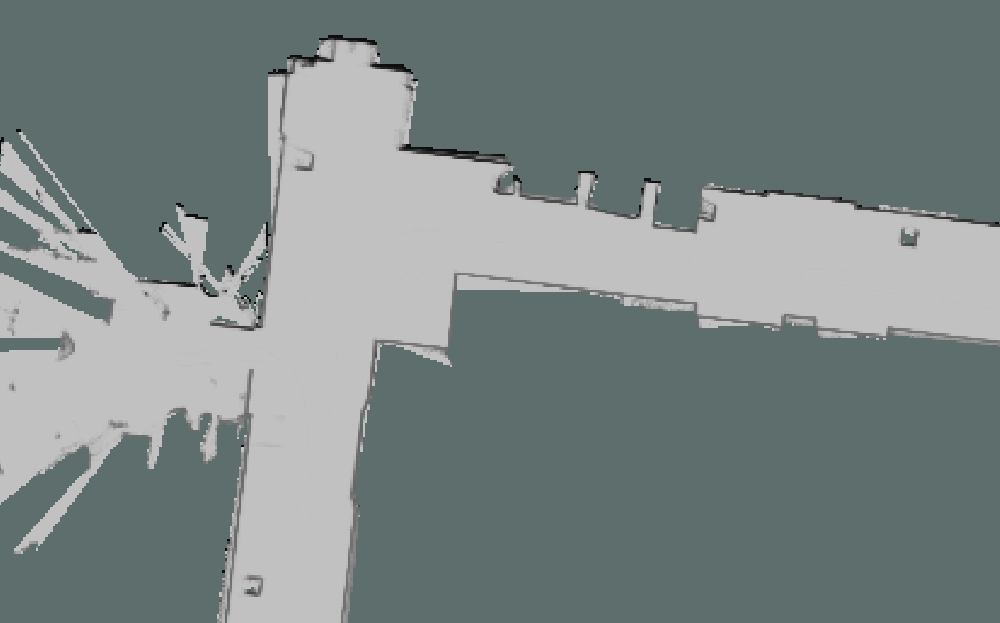
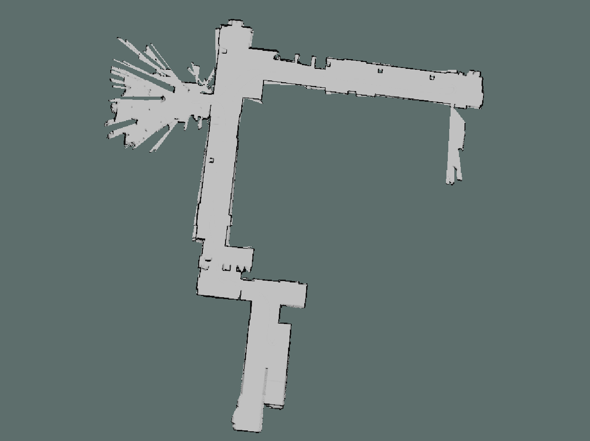
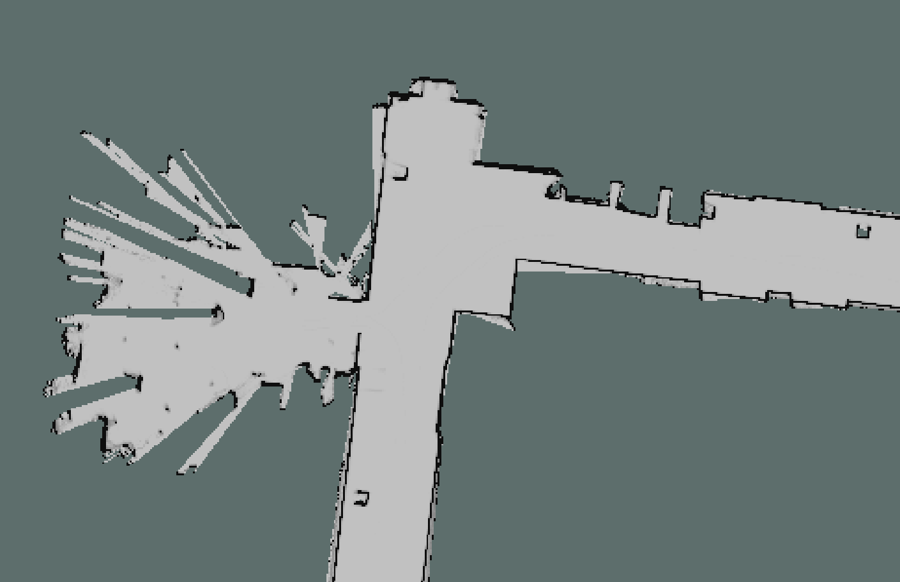
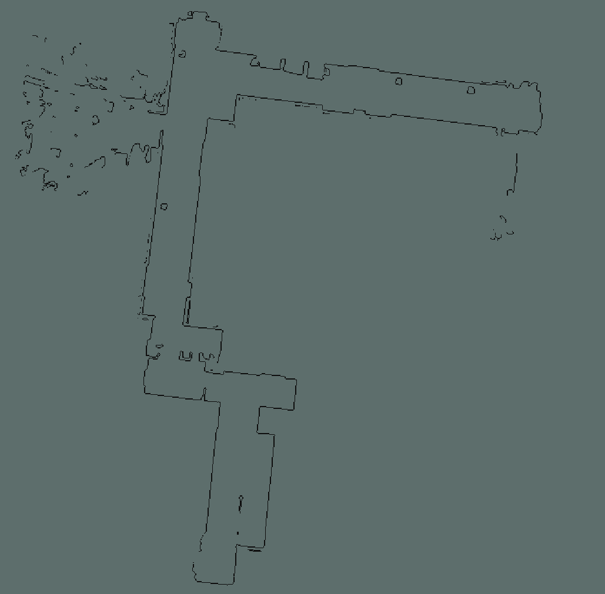
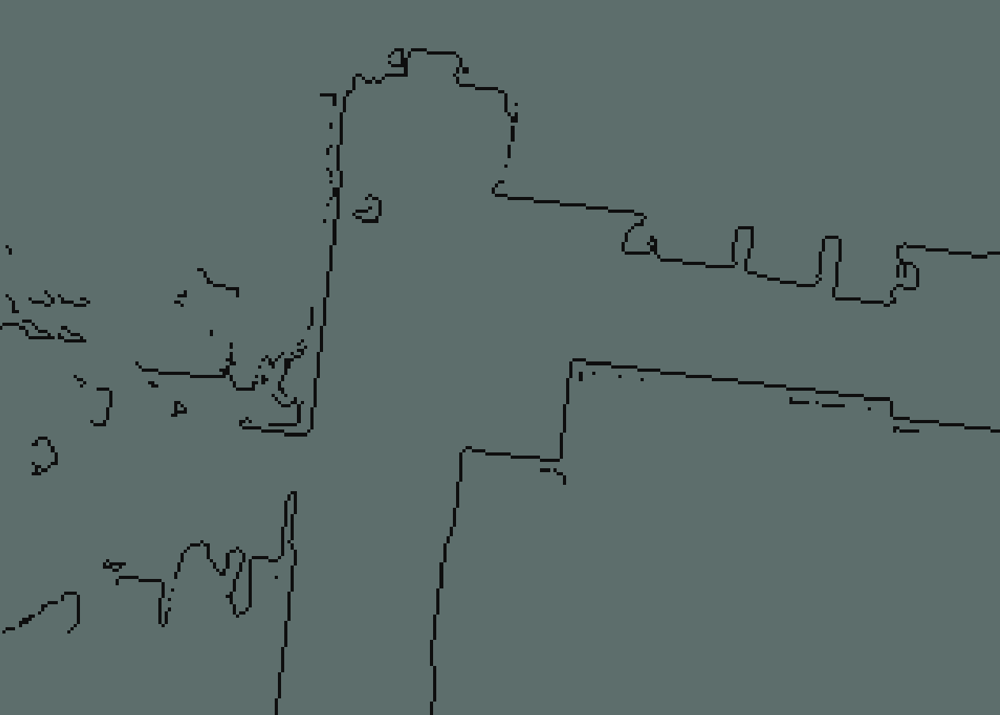

1. > 补充代码，通过覆盖栅格建图算法进行栅格地图构建；（3 分）
  
    ```cpp
        //start of TODO 对对应的map的cell信息进行更新．（1,2,3题内容）
        //1
        GridIndex beamPointIndex = ConvertWorld2GridIndex(world_x, world_y);
        std::vector<GridIndex> beamTraceindexes = TraceLine(robotIndex.x, robotIndex.y, beamPointIndex.x, beamPointIndex.y);
        for(auto index : beamTraceindexes)
        {
            if(isValidGridIndex(index))
            {
                int tmpLinearIndex = GridIndexToLinearIndex(index);
                if(pMap[tmpLinearIndex] == 0) continue;
                pMap[tmpLinearIndex] += mapParams.log_free;
            }else{
                std::cerr << "index is invalid!!!" << std::endl;
            }
        }
        if(isValidGridIndex(beamPointIndex))
        {
            int tmpLinearIndex = GridIndexToLinearIndex(beamPointIndex);
            
            pMap[tmpLinearIndex] += mapParams.log_occ;
            if(pMap[tmpLinearIndex] >= 100) pMap[tmpLinearIndex] = 100;
        }else{
            std::cerr << "beamPointIndex is invalid!!!" << std::endl;
        }
        //end of TODO
    ```
  
    运行结果如下：  
    ```sh
        $ rosrun occupany_mapping occupany_mapping
        poses.size(): 3701
        Read Pose Good!!!
        Read Angle good:1081
        XX:1081
        laserscans.size():3701
        Read Laser Scans Good!!!!
        开始建图，请稍后...
        建图完毕
    ```
  
    整体结果图：  
    
    局部结果图：  
    
  
    *地图消息说明[nav_msgs/OccupancyGrid.msg](http://docs.ros.org/en/melodic/api/nav_msgs/html/msg/OccupancyGrid.html)。*  
  
2. > 将第 1 题代码改为通过计数建图算法进行栅格地图构建；（3 分）
  
    ```cpp
        //start of TODO 对对应的map的cell信息进行更新．（1,2,3题内容）
        //2
        GridIndex beamPointIndex = ConvertWorld2GridIndex(world_x, world_y);
        std::vector<GridIndex> beamTraceindexes = TraceLine(robotIndex.x, robotIndex.y, beamPointIndex.x, beamPointIndex.y);
        for(auto index : beamTraceindexes)
        {
            if(isValidGridIndex(index))
            {
                int tmpLinearIndex = GridIndexToLinearIndex(index);
                ++pMapMisses[tmpLinearIndex];
            }else{
                std::cerr << "index is invalid!!!" << std::endl;
            }
        }
        if(isValidGridIndex(beamPointIndex))
        {
            int tmpLinearIndex = GridIndexToLinearIndex(beamPointIndex);
            ++pMapHits[tmpLinearIndex];
        }else{
            std::cerr << "beamPointIndex is invalid!!!" << std::endl;
        }
        //end of TODO
    ```
  
    ```cpp
        //start of TODO 通过计数建图算法或TSDF算法对栅格进行更新（2,3题内容）
        //2
        for (int i = 0; i < mapParams.width * mapParams.height; ++i)
        {
            if((pMapHits[i] + pMapMisses[i]) != 0 )
            {
                pMap[i] = (double)pMapHits[i]/(pMapHits[i] + pMapMisses[i]) * 100;
                if(pMap[i] >=35) pMap[i] = 100;
                // if(pMapHits[i] != 0)
                //     std::cout << pMapHits[i] << " " << pMapMisses[i] << " " << (int)pMap[i] << std::endl;
            }
        }
        //end of TODO
    ```
  
    运行后发现，如果阈值设置较大，地图边界不清晰，总体结果图如下：  
    
    局部结果图：  
    
  
    将阈值改为35后，地图边界变得清晰，总体结果图如下：  
    
    局部结果图：  
    
  
3. > 将第 1 题代码改为通过 TSDF 建图算法进行栅格地图构建；（4 分）
  
    ```cpp
        //start of TODO 对对应的map的cell信息进行更新．（1,2,3题内容）
        //3
        double far_dist = dist + 0.142; //0.05*2*sqrt(2)
        //计算得到该激光点的世界坐标系的坐标
        double far_laser_x = far_dist * cos(angle);
        double far_laser_y = far_dist * sin(angle);

        double far_world_x = cos(theta) * far_laser_x - sin(theta) * far_laser_y + robotPose(0);
        double far_world_y = sin(theta) * far_laser_x + cos(theta) * far_laser_y + robotPose(1);
        GridIndex farBeamPointIndex = ConvertWorld2GridIndex(far_world_x, far_world_y);
        std::vector<GridIndex> farBeamTraceindexes = TraceLine(robotIndex.x, robotIndex.y, farBeamPointIndex.x, farBeamPointIndex.y);
        for(auto index : farBeamTraceindexes)
        {
            if(isValidGridIndex(index))
            {
                //栅格坐标系转换到世界坐标系
                double x = (index.x - mapParams.offset_x) * mapParams.resolution + mapParams.origin_x;
                double y = (index.y - mapParams.offset_y) * mapParams.resolution + mapParams.origin_y;
                double d = std::sqrt((x-robotPose(0))*(x-robotPose(0)) + (y-robotPose(1))*(y-robotPose(1)));
                double sdf = dist - d;
                double tsdf = std::max(-1.0, std::min(1.0, sdf/0.1));
                int tmpLinearIndex = GridIndexToLinearIndex(index);
                pMapTSDF[tmpLinearIndex] = (pMapW[tmpLinearIndex]*pMapTSDF[tmpLinearIndex] + tsdf) / (pMapW[tmpLinearIndex] + 1);
                pMapW[tmpLinearIndex] = pMapW[tmpLinearIndex] + 1;
            }else{
                std::cerr << "index is invalid!!!" << std::endl;
            }
        }
        //end of TODO
    ```

    ```cpp
        //start of TODO 通过计数建图算法或TSDF算法对栅格进行更新（2,3题内容）
        //3
        //test code
        // for (int i = 0; i < mapParams.width * mapParams.height; ++i)
        // {
        //     pMap[i] = pMapTSDF[i] * 100;
        // }

        for (int i = 0; i < mapParams.width-1; ++i) //x
        {
            for(int j = 0; j < mapParams.height-1; ++j) //y
            {
                GridIndex tmpOrgIndex;
                tmpOrgIndex.SetIndex(i, j);
                int tmpOrgLinearIndex = GridIndexToLinearIndex(tmpOrgIndex);
                double tmpOrgTSDF = pMapTSDF[tmpOrgLinearIndex];
                if(tmpOrgTSDF==1 || tmpOrgTSDF==-1) continue;   //去除未击中点

                GridIndex tmpUpIndex;
                tmpUpIndex.SetIndex(i, j+1);
                int tmpUpLinearIndex = GridIndexToLinearIndex(tmpUpIndex);
                double tmpUpTSDF = pMapTSDF[tmpUpLinearIndex];

                GridIndex tmpRightIndex;
                tmpRightIndex.SetIndex(i+1, j);
                int tmpRightLinearIndex = GridIndexToLinearIndex(tmpRightIndex);
                double tmpRightTSDF = pMapTSDF[tmpRightLinearIndex];

                //没有求出精确位置，直接求出地图坐标
                if((tmpOrgTSDF<0 && tmpUpTSDF>0) || (tmpOrgTSDF>0 && tmpUpTSDF<0))
                {
                    if(std::fabs(tmpOrgTSDF) < std::fabs(tmpUpTSDF))
                    {
                        pMap[tmpOrgLinearIndex] = 100;
                    }else{
                        pMap[tmpUpLinearIndex] = 100;
                    }
                }
                if((tmpOrgTSDF<0 && tmpRightTSDF>0) || (tmpOrgTSDF>0 && tmpRightTSDF<0))
                {
                    if(std::fabs(tmpOrgTSDF) < std::fabs(tmpRightTSDF))
                    {
                        pMap[tmpOrgLinearIndex] = 100;
                    }else{
                        pMap[tmpRightLinearIndex] = 100;
                    }
                }
            }
        }
        //end of TODO
    ```
  
    运行后总体结果图如下：  
    
    局部结果图：  
    
  
    *转角位置不好求，没有啥好办法，这里没有求出精确位置，直接求出地图坐标，后续有好办法再更新。*  
  
4. > 简答题，开放性答案：总结比较课堂所学的 3 种建图算法的优劣。（2 分）
  
    覆盖栅格建图算法对栅格更新只需进行加法操作，更新速度较快；计数建图算法也是进行加法操作，但是需要额外存储misses和hits，需要额外占用一些内存。  
    上述两个算法都没有考虑传感器的不确定性，如果噪声叠加，可能出现对同一障碍物有多个栅格厚度的地图。  
    TSDF建图算法充分考虑传感器测量的不确定性，如果传感器的噪声服从高斯分布，那么通过TSDF进行融合，等价于通过最小二乘来进行融合，能插值出确切的曲面，构建的地图最多只有一个栅格的厚度，但是计算更复杂，更新速度较慢。  
  