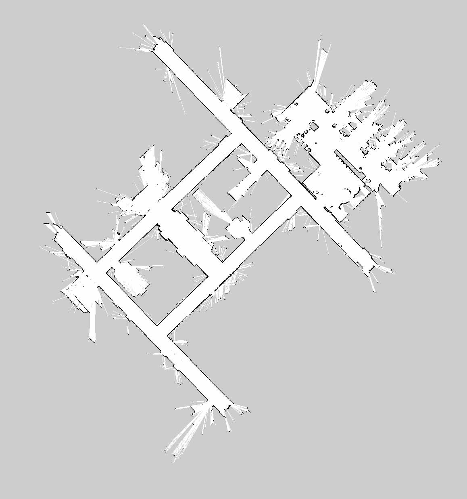
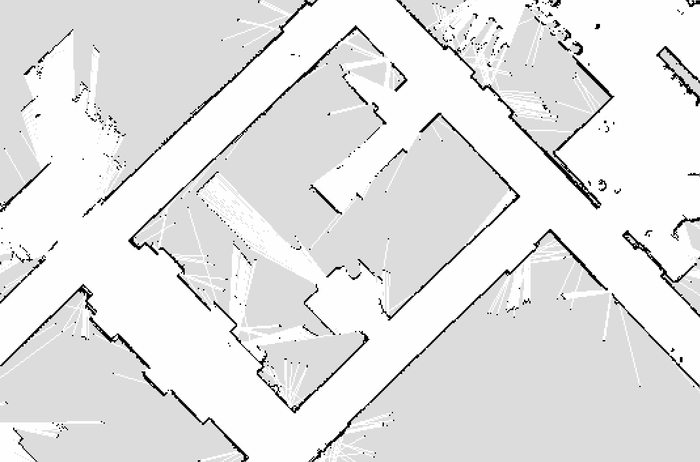
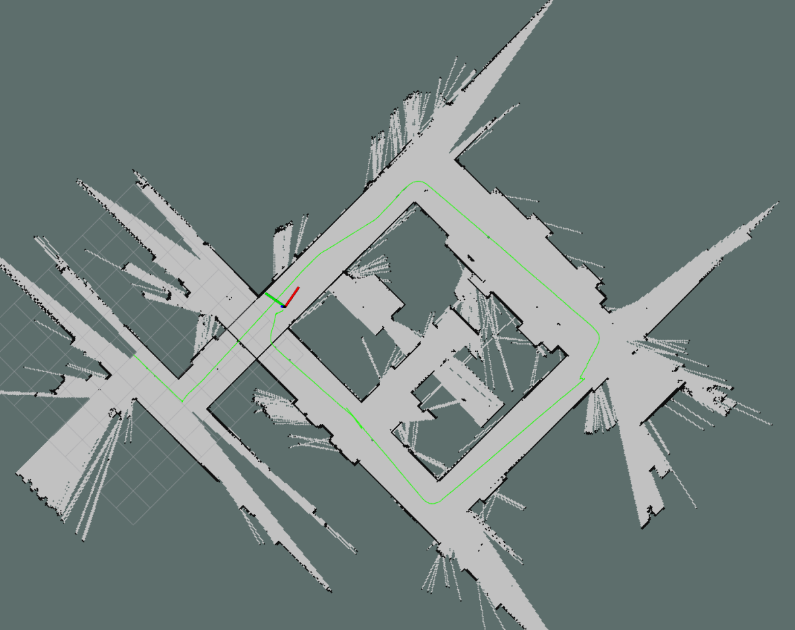
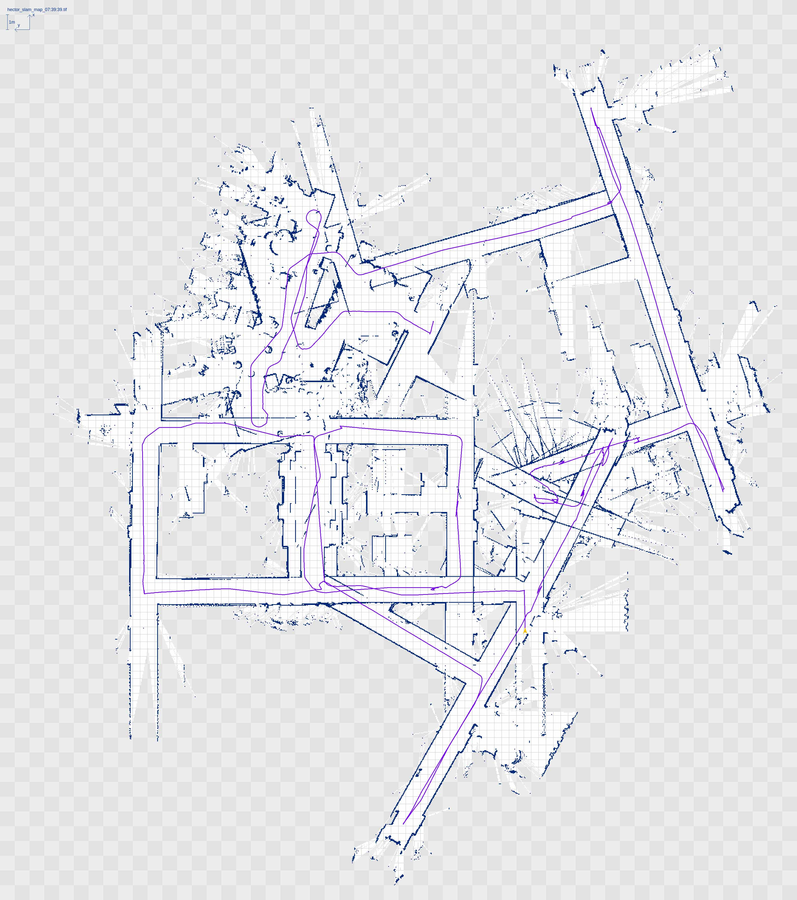
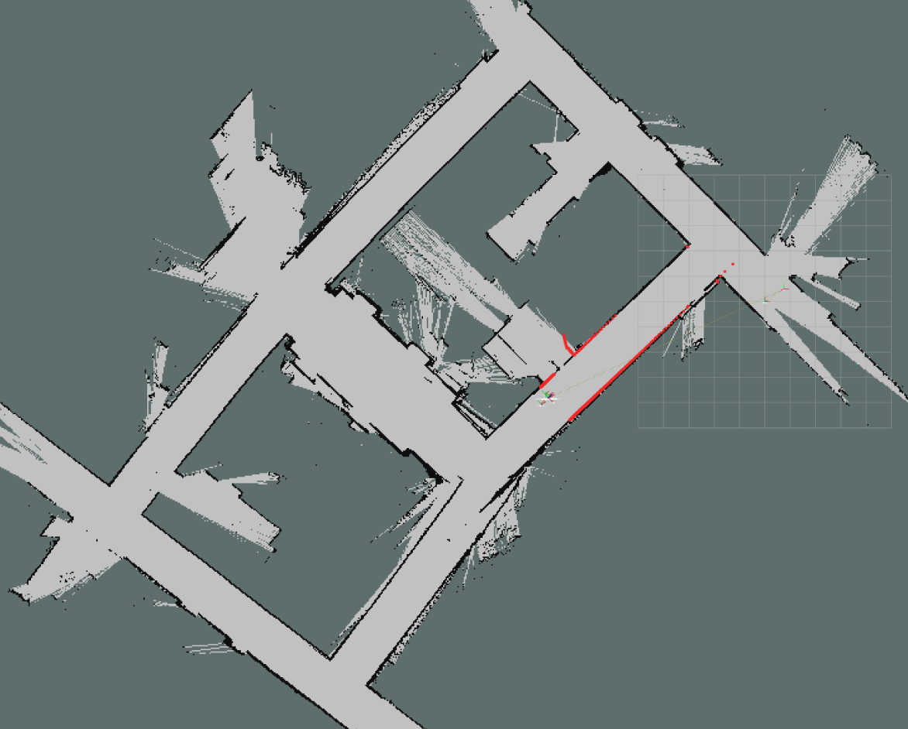
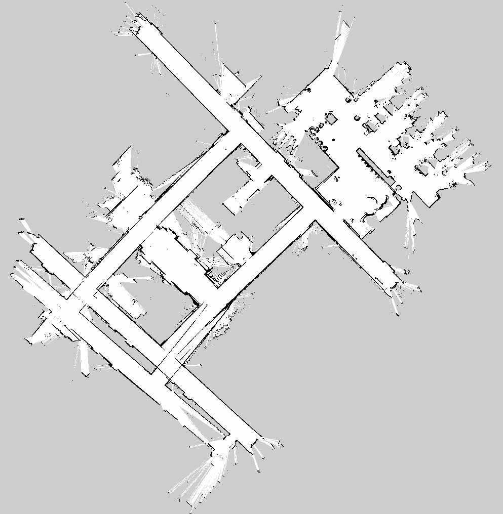
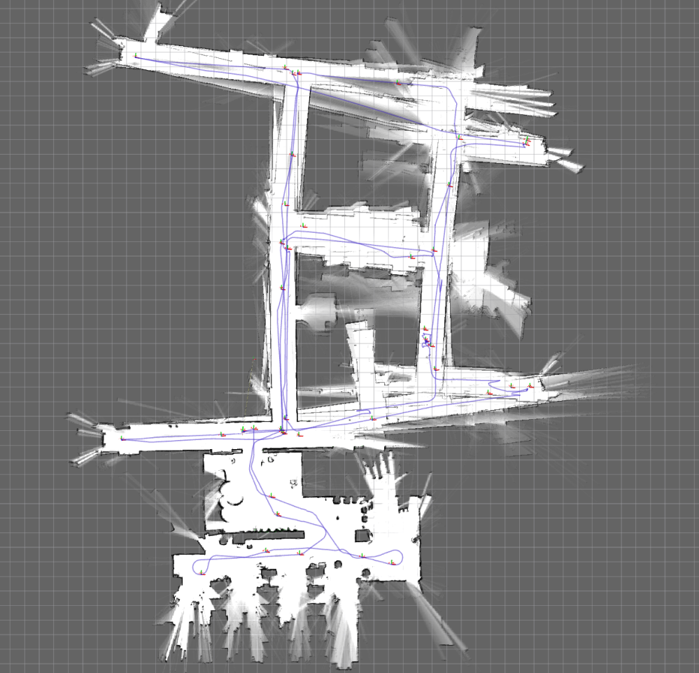
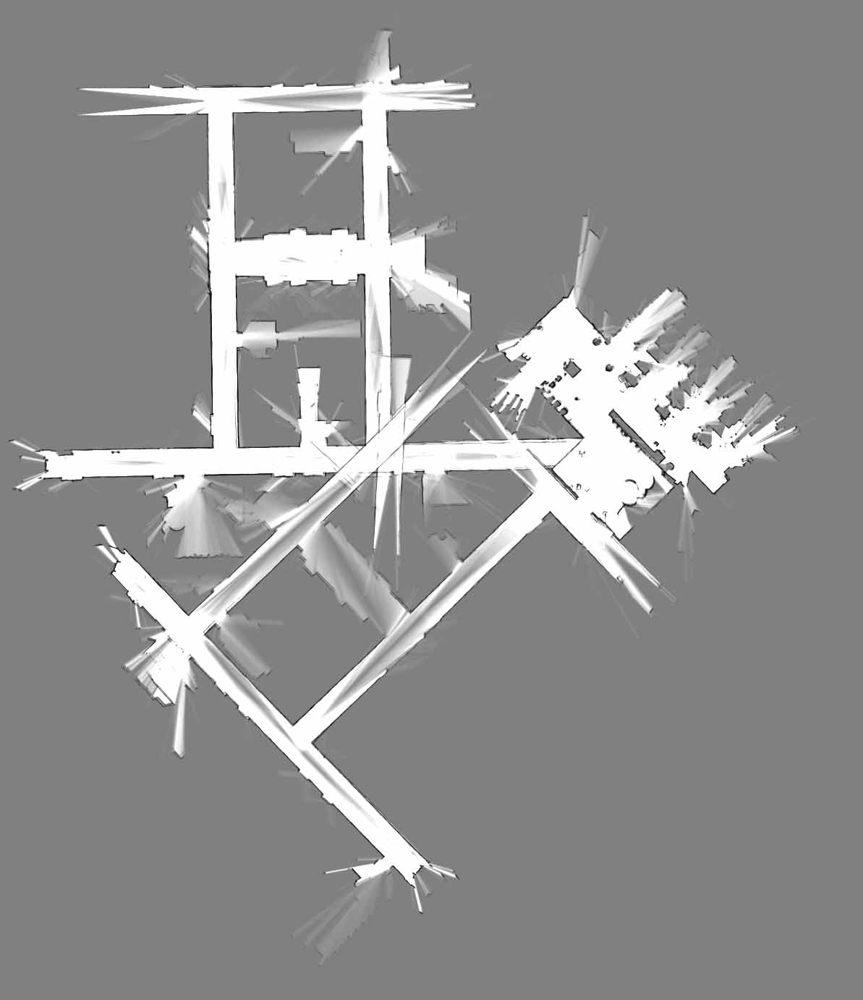
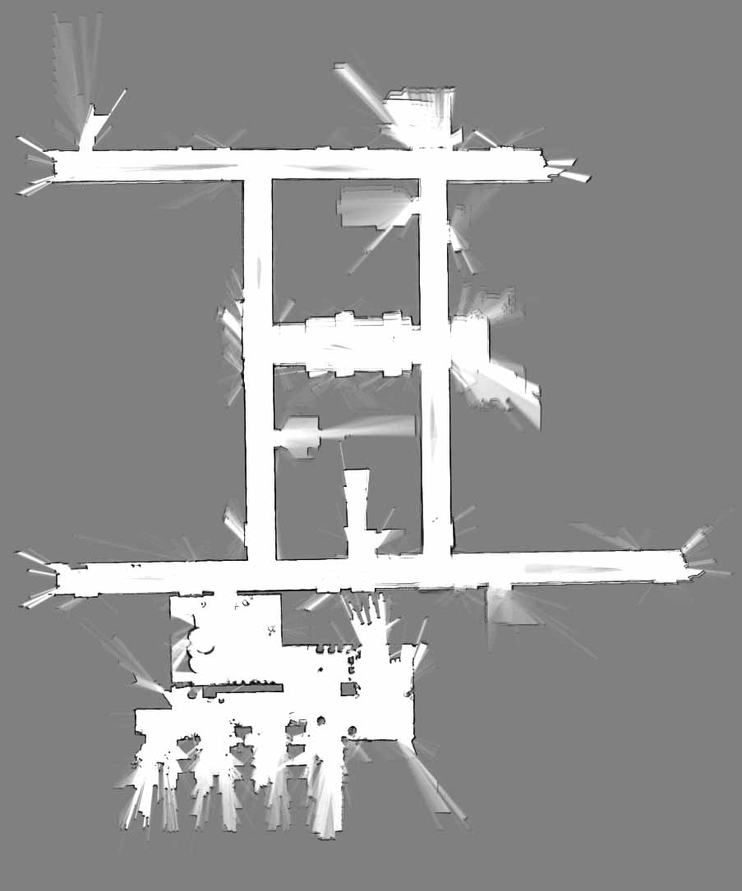
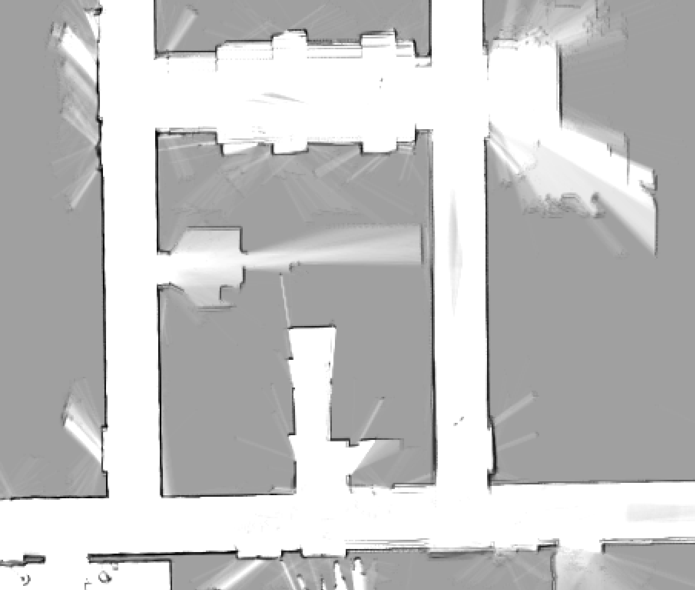

1. > 大作业内容 3 选 1：
  
   1. > 实现一个完整的激光 SLAM 算法。把前面各小节的内容串联起来，可以用前面作业提供的 rosbag，也可以其它的数据集。

   2. > 运行并测试 GMapping，Hector Slam, Karto, Google Cartographer 等开源激光 SLAM 算法，并给出详细的测试对比报告。不同场景下/数据集的精度，速度，是否有回环，算法差异等。

   3. > 选择一个激光+IMU/IMU/视觉/里程计/GNSS 或激光与其它多传感器融合的技术方向做调研，撰写总结报告，最好附上简单的代码实现。
  
  *PS：刚学完前面的课程感觉都懂了，开始做大作业突然发现自己顶多算是入门。首先做的是第1题，计划前端使用高斯牛顿，后端图优化找回环，地图用覆盖栅格。然后，发现图优化需要信息矩阵，网上查找一番，找到可以用Hessian矩阵来表示Information矩阵，最终修修改改磨磨蹭蹭写到了周末晚上，此时距离发布该作业已过去一周，问题还是比较多，也不知道下周能不能搞定，决定先做第二题好了。选第二题，打算将上述开源算法都跑通，参数全部使用默认参数，使用同一个bag跑一遍，初步体验下各个开源算法。（如何定量测试还需研究，如果要将参数调整到比较优的状态需要对算法有相当的了解，目前只想尽快完成作业，对当前的课程画上一个句号）*  
  使用的测试平台硬件为：轮子编码器、imu、激光雷达，软件上使用robot_localization融合由编码器解算得到的里程计和imu。环境中有类长走廊环境，路线上线走个小环，后面里程计有出错，但是融合imu还是可以用的。下面所有的建图结果都由同一个bag过滤得到。  
  
2. GMapping  
   1. 介绍  
        优点：在长廊及低特征场景中建图效果好；  
        缺点：依赖里程计（odometry）且无回环；  
        GMapping在构建小场景地图所需的计算量较小且精度较高。相比Hector SLAM对激光雷达频率要求低、鲁棒性高（Hector 在机器人快速转向时很容易发生错误匹配，建出的地图发生错位，原因主要是优化算法容易陷入局部最小值）；而相比Cartographer在构建小场景地图时，GMapping不需要太多的粒子并且没有回环检测因此计算量小于Cartographer而精度并没有差太多。  
        放上[gmapping ros wiki](http://wiki.ros.org/slam_gmapping)，里面有教程照着来就行。
  
    1. 测试  
        使用融合后的odom（tf）与激光数据，整体图看起来还可以，如下图所示：
        
        再来个局部放大图：
        
  
3. Hector  
   1. 介绍  
        优点：不需要使用里程计；  
        缺点：对激光雷达的要求较高（更新频率较高，测量噪声小）且无回环，在长走廊环境中容易错误匹配，且在里程计数据比较精确的时候，无法有效利用里程计信息；  
        利用高斯牛顿方法解决scan-matching问题，获得激光点集映射到已有地图的刚体变换；为避免局部最小而非全局最优，使用多分辨率地图；在制图过程中，需要robot速度控制在比较低的情况下，建图效果才会比较理想。  
        放上[hector ros wiki](http://wiki.ros.org/hector_slam)，也是有教程的。
  
   2. 测试  
        仅使用激光数据，第一圈小环就没建好，在长走廊的那一段建短了，如下所示：
        
        最后整体图惨不忍睹，主要是环境中存在长走廊和机器人在几个位置旋转过快，如下所示：
        
  
4. Karto
   1. 介绍  
        优点：有回环；
        缺点：依赖里程计；
        KartoSLAM是基于图优化的方法，用高度优化和非迭代cholesky矩阵进行稀疏系统解耦作为解，图优化方法利用图的均值表示地图，每个节点表示机器人轨迹的一个位置点和传感器测量数据集，箭头的指向的连接表示连续机器人位置点的运动，每个新节点加入，地图就会依据空间中的节点箭头的约束进行计算更新。  
        KartoSLAM的ROS版本，其中采用的稀疏点调整（the Spare Pose Adjustment(SPA)）与扫描匹配和闭环检测相关。landmark越多,内存需求越大，然而图优化方式相比其他方法在大环境下制图优势更大，在某些情况下KartoSLAM更有效,因为他仅包含点的图(robot pose)，求得位置后再求map。  
        放上[karto ros wiki](http://wiki.ros.org/slam_karto)，没有教程，需要自己摸索下。
  
    1. 安装与运行
        ```sh
          sudo apt-get install ros-${ROS_DISTRO}-slam-karto
        ```
        ```sh
          roscore
        ```
        ```sh
          rosparam set use_sim_time true
          rosrun slam_karto slam_karto
        ```
        ```sh
          rosbag play output2.bag --clock
        ```
        ```sh
          rviz
        ```
  
   2. 测试  
        第一圈小环建的马马虎虎，第二圈大环就开始不行了，看了好几遍，出问题的地方里程计数据应该是没有问题的，建的图如下所示：
        
        最终的效果还是有比较大的提升空间，跑了几次数据，地图还不太一样，放出其中一次的
        
  
5. cartographer  
   1. 介绍  
        优点：有回环，后端支持多线程，可以使用里程计也可以不使用里程计；  
        缺点：占用CPU较大，也会占用一些内存；  
        cartographer是基于图优化的方法，采取的是google的ceres构建problem优化，采用了submap的概念，依据一定数量的scan初始一个submap, 依据窗口大小，插入newScan，更新submap，有子图缓存，会占用内存。  
        用分支定界原理加速求解过程（相对于暴力求解），进行深度有限优先搜索，CSM计算得到初始最高分数，确定深度，分支就是进行拓展，定界就是剪枝。提高运算效率。 
        放上[cartographer官方说明](https://google-cartographer-ros.readthedocs.io/en/latest/compilation.html)，讲得还是比较详细的。
  
   2. 测试  
        仅使用激光数据不使用odom的时候，如果碰到长走廊也是会匹配出错的，如下图所示：
        
        下面使用原始的odom和imu数据。在第一次odom出现小问题后纠正回来了，但是第二次odom出现大问题后没纠正回来，感觉cartographer没有很好地利用imu数据，起初修改了前端 `odometry_rotation_weight = 0` ，后来后端的权重也修改了一些，但是都没有改善，就放弃了，最终效果如下：
        

        接着使用融合后的odom和imu数据，最终效果问题不大，但是有些地方存在重影，整体效果如下：
        
        局部放大图如下：
        
  
*列举下资料，写第1题时查找到的资料，[信息矩阵](https://www.zhihu.com/question/388238460)；写第2题前查找的资料，目前没有很好地用起来，[EVO使用方法详解](https://blog.csdn.net/dcq1609931832/article/details/102465071)；一些SLAM开源算法对比的参考资料，[2D激光SLAM算法汇总](https://zhuanlan.zhihu.com/p/78334136?utm_source=wechat_timeline)；[cartographer与karto的比较](https://blog.csdn.net/hzy925/article/details/78857241)，这篇主要是参考了论文：SmokeNav –Simultaneous Localization and Mapping in Reduced Visibility Scenarios，[对比几种在ROS中常用的几种SLAM算法](https://www.cnblogs.com/li-yao7758258/p/8213578.html)。*  
  